------------------------------------------------------------------------

## Lecture 1: Introduction and Overview

------------------------------------------------------------------------

### What we'll cover today

-   Syllabus and expectations

-   Course overview

{width="400"}

------------------------------------------------------------------------

### My goals for this class

-   Give you tools to analyze exposures

-   Help you understand strengths and limitations of exposure data

-   Help you understand possible approaches to data analysis

-   Give you the ability to conduct analyses of exposure data, ranging from simple to sophisticated

------------------------------------------------------------------------

### Motivation for developing this class

-   Historical focus of exposure science has been on exposure assessment

    -   In other words, collection of exposure data

-   Current focus still stresses this

    -   Exposome, epidemiology

-   Less focus/training on how to make sense of data collected

------------------------------------------------------------------------

### Example of why we need this class (at least in my experience)

-   Datasets used in biostatistics and epidemiology classes

    -   Clean, well-organized, well-documented

-   Real life exposure datasets

    -   Usually none of the above

{width="300"}

------------------------------------------------------------------------

### Syllabus and expectations

-   Syllabus on Canvas

    -   Any changes will be announced via Canvas

-   Readings posted on Canvas

-   Assignments posted on Canvas

-   Pretty much everything... on Canvas

------------------------------------------------------------------------

### Components of this class

-   Lectures will

    -   Describe common data analysis techniques

    -   Familiarize you with different approaches

-   Labs periods will

    -   Give us a common environment to explore shared dataset and apply analytical techniques

-   Readings will

    -   Provide examples of application of approaches

------------------------------------------------------------------------

### Evaluation

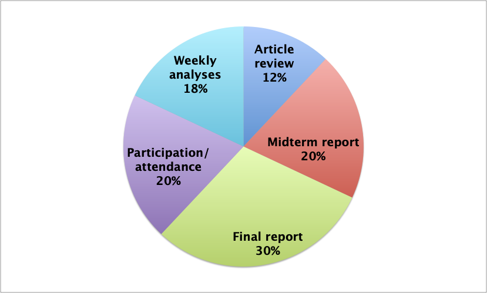{width="600"}

------------------------------------------------------------------------

### Evaluation

-   Class participation and attendance

    -   Pretty straightforward - come and participate!

-   Weekly analysis questions

    -   Short answers posed about newly available data and readings

-   Article review

    -   "Poster" on exposure analysis paper

-   Midterm report

    -   Preliminary analysis results

-   Final report

    -   Final analysis results, recommendations

{width="300"}

------------------------------------------------------------------------

### My expectations of you

-   Come to class (on time)

-   Don't be shy - participate

-   Ask questions

-   Let me know if aspects of class aren't working

------------------------------------------------------------------------

### Assignment schedule

------------------------------------------------------------------------

### Overview of exposure analysis

-   Information -\> data when organized

-   Data -\> understanding when analyzed

-   Analysis lets us tell a story with data

-   How to test success of analysis

    -   Ask "Can I now explain these data?"

------------------------------------------------------------------------

### Data

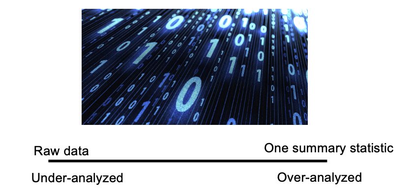

------------------------------------------------------------------------

### The evolution of understanding data

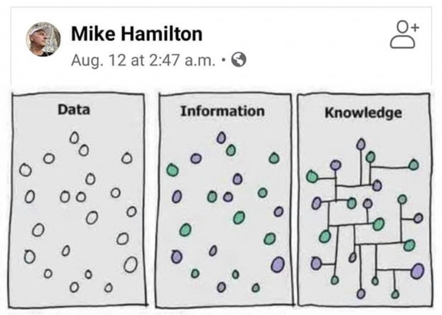{width="500"}

------------------------------------------------------------------------

### Definitions

-   [**Exposure:**]{.underline} level or quantity of contact with an agent

    -   Different from vector carrier (e.g., air, water)

-   [**Agent:**]{.underline} chemical, biological, physical hazard or set of conditions capable of causing biological response

-   [**Dose:**]{.underline} level or quantity of agent actually deposited within body

-   [**Response:**]{.underline} biological response to agent

------------------------------------------------------------------------

### The ugly truth about exposure

-   True exposure (T) can never be perfectly measured

-   Wee need to define aspect(s) of exposure (E) and dose (D) that can be measured

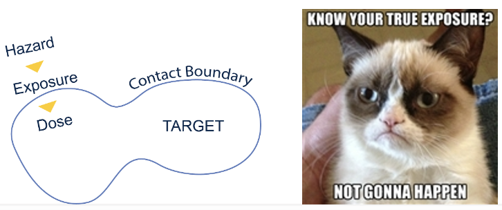{width="500"}

------------------------------------------------------------------------

### Exposures can be...

-   Simple (e.g., single medical x-ray)

    -   Single, short duration, known exposure, known dose, well-documented

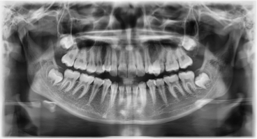{width="300"}

-   Really complex

    -   (e.g., 1 year of exposure to water pollution)

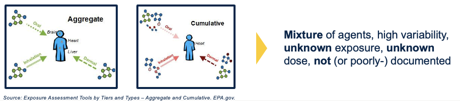

------------------------------------------------------------------------

### Examples of types of agents

-   May cause acute physiological effects (e.g., food)

-   May cause or protect from disease or injury

-   Influence disease diagnosis or outcome (e.g., screening procedures, treatment)

------------------------------------------------------------------------

### What is exposure analysis?

-   Process that quantifies human contact with a hazard

-   Quantification of exposure

    -   Across individuals

    -   Across time

    -   Across space

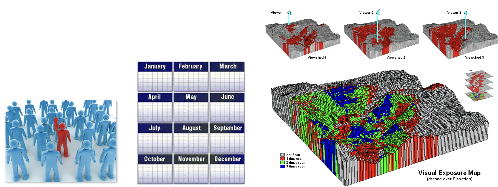{width="600"}

------------------------------------------------------------------------

### Challenges related to scope of "big" exposure data

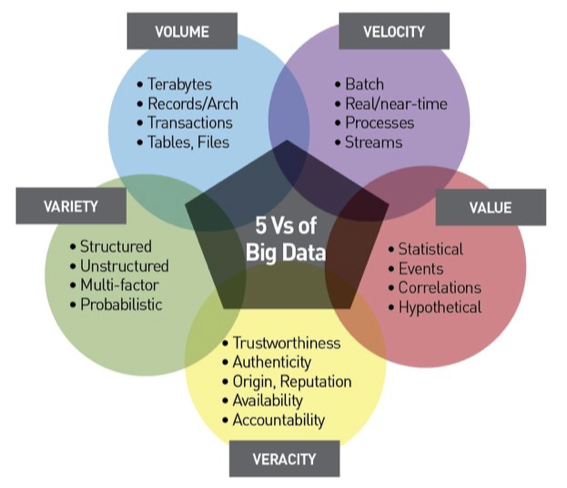{width="450"}

::: {.absolute bottom="0"}
<https://synergist.aiha.org/202012-ih-data-standardization>
:::

------------------------------------------------------------------------

### Where does exposure analysis lie in exposure-response model?

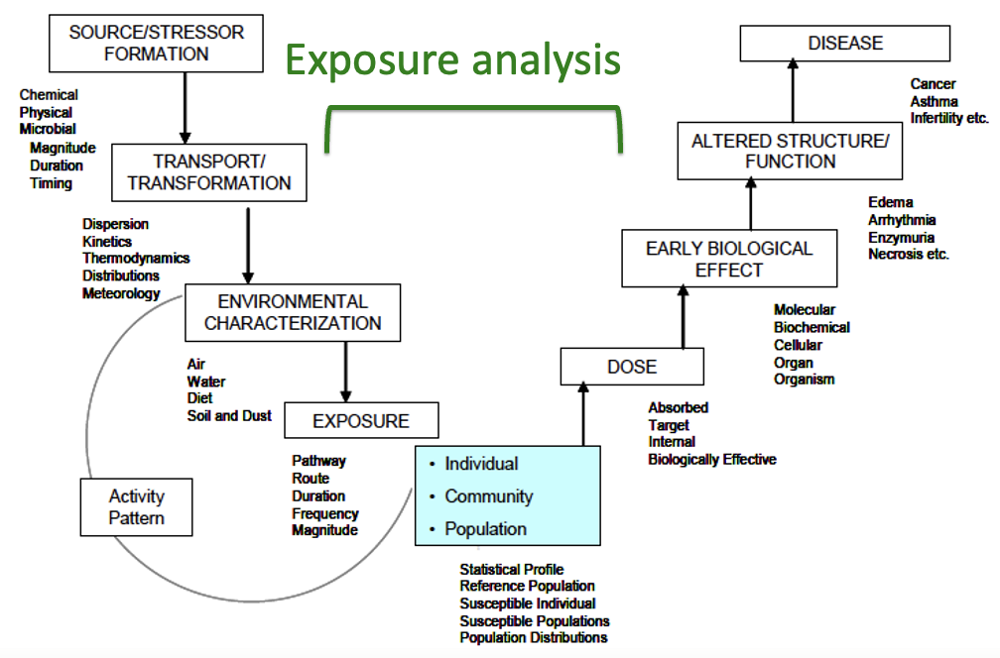{width="500"}

------------------------------------------------------------------------

### Data collections vs exposure prediction vs exposure estimation

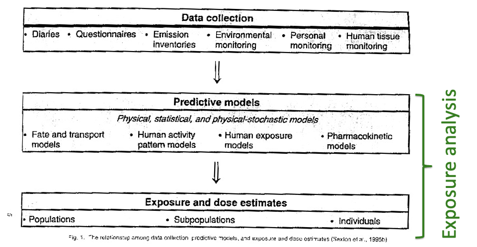{width="500"}

------------------------------------------------------------------------

### Why do we need exposure analysis?

-   Without it, we can't relate exposure to response

-   Exposure measurements increasingly yield vast amounts of data

    -   Real-time sensing, crowdsourced data collection, longitudinal monitoring

    -   Need increasingly sophisticated and robust analytical approaches

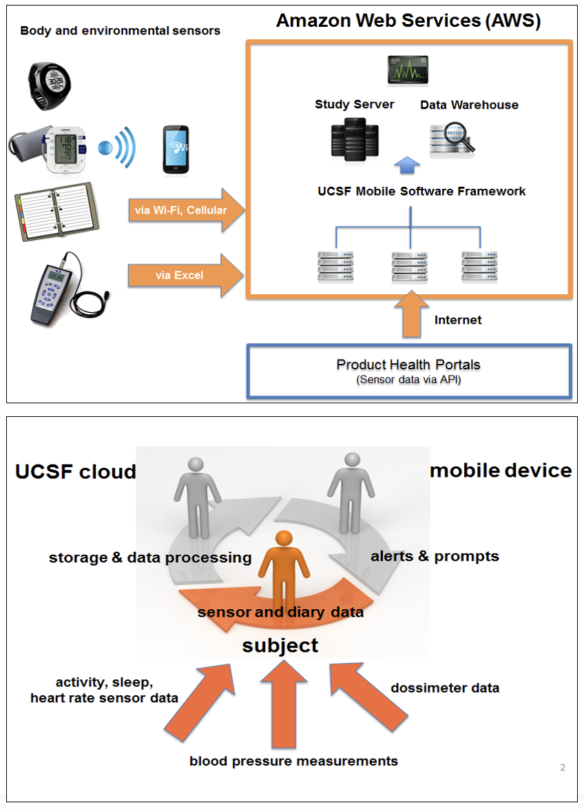{width="400"}

------------------------------------------------------------------------

### Goals of exposure analysis

-   Create most accurate estimates of exposure possible

-   Evaluate exposure controls

    -   Need for

    -   Effectiveness of

-   Characterize exposure-response relationship

-   Understand compliance with regulatory and recommended exposure limits

------------------------------------------------------------------------

### Historical context for exposure analysis

-   Early exposure-response analysis

    -   Substantial exposures

    -   Substantial health risks

-   Simple approaches were sufficient

-   Current exposures, health risks lower, more variable

-   More complex exposures require increasingly sophisticated analyses

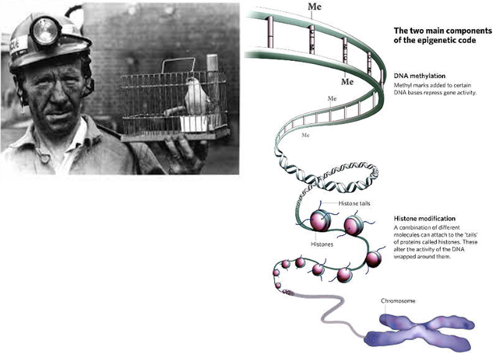{width="400"}

------------------------------------------------------------------------

### Difficulties in exposure analysis

-   May be no single cause for outcome or interest (e.g., multitude of possible agents)

    -   Any single component may contribute little to outcome risk

-   Interval from onset of exposure to outcome often long (e.g., weeks, months, years, or decades)

-   Agent may leave no measurable indicator of past exposure

-   Complex exposures (e.g., diet, psychosocial)

::: {.absolute bottom="0"}
White E, Armstrong BK, Saracci R. 2008
:::

------------------------------------------------------------------------

### What happens if we do it poorly?

-   Inaccurate exposure estimates are source of bias in epidemiological studies

-   Magnitude of bias is under-appreciated

    -   Small errors in assigned exposures can reduce epidemiological risk ratios by 50% or more!

-   Greatly reduces our ability to accurately characterize exposure-response relationship

-   Could this at least partially explain discrepancies between lab and human studies?

------------------------------------------------------------------------

### Information we need to understand exposure and dose

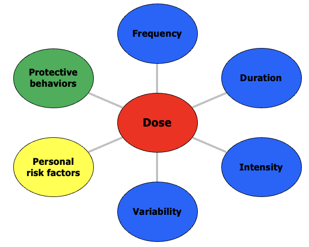{width="450"}

------------------------------------------------------------------------

### Question: how to get exposure information for these situations?

-   Silica exposure to communities near fracking sites?

-   Exposure to cosmic radiation in flight crews?

-   Exposures to norovirus among daycare facilities?

-   Micronutrient exposures through diet?

------------------------------------------------------------------------

### Exposure analysis issues

-   What kinds of data are available?

-   Personal vs. potential (environmental or area) exposure measurement

-   Subjective vs. objective data

-   Present vs. past exposure

------------------------------------------------------------------------

### Examples of exposure information

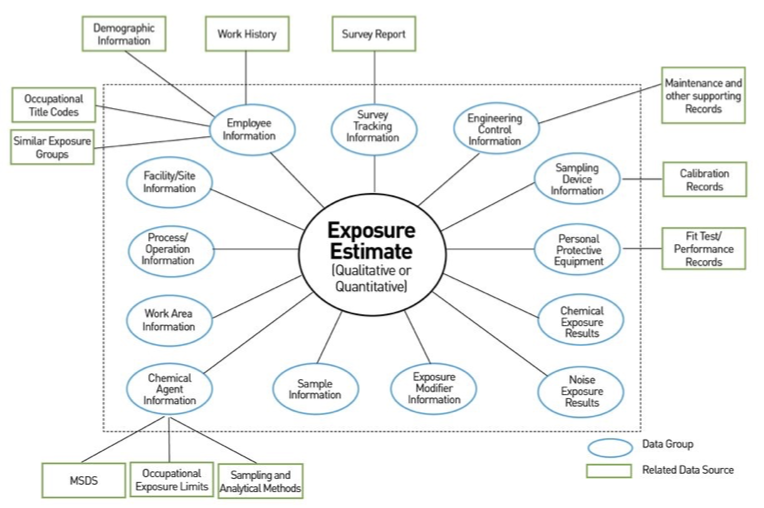{width="500"}

::: {.absolute bottom="0"}
<https://synergist.aiha.org/202012-ih-data-standardization>
:::

------------------------------------------------------------------------

### Examples of exposure information quality (from reading)

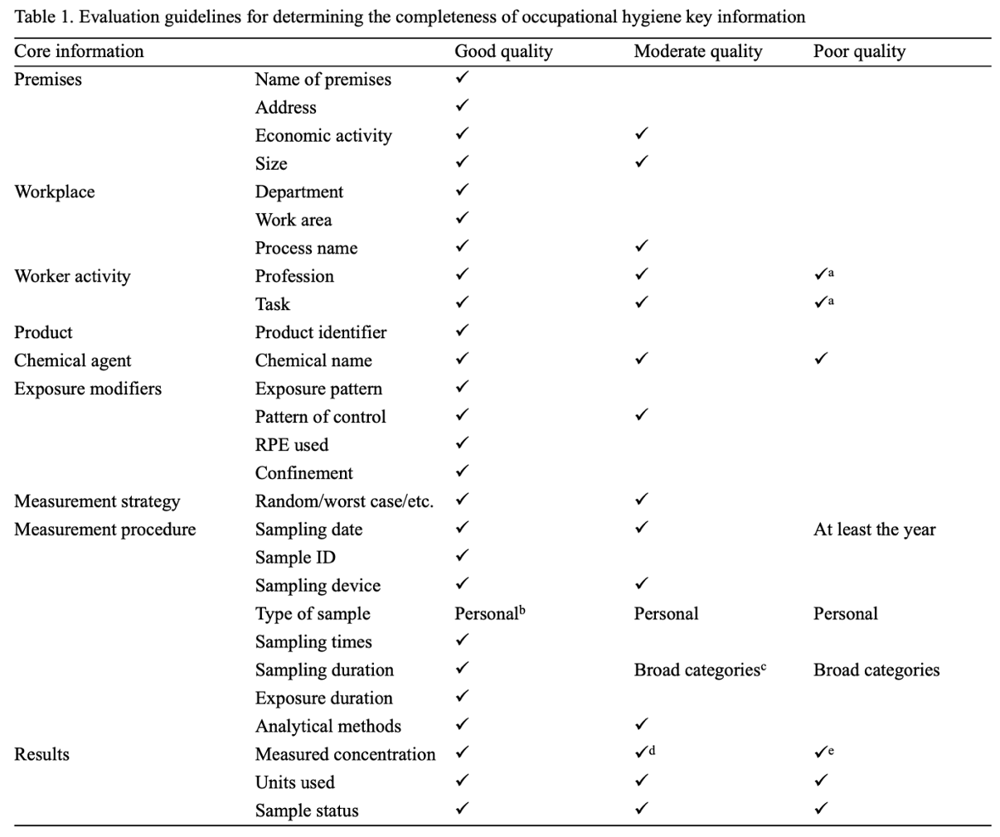{width="600"}

------------------------------------------------------------------------

### Levels of exposure analysis

-   Ideally, we would have actual, individual-level measurements over entire exposure period

    -   Individual-level analysis

    -   Just compute average/cumulative exposure

    -   Sound to good to be true? It is. Almost never possible

-   Alternatively, can do group-level analysis

    -   *A priori*

    -   *A posteriori*

-   Or hybrid analysis combining individual and group

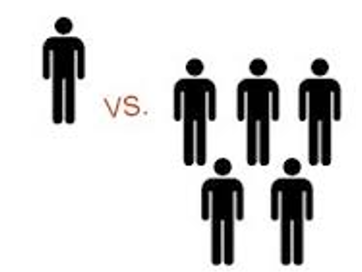{width="200"}

------------------------------------------------------------------------

### How do we describe exposures?

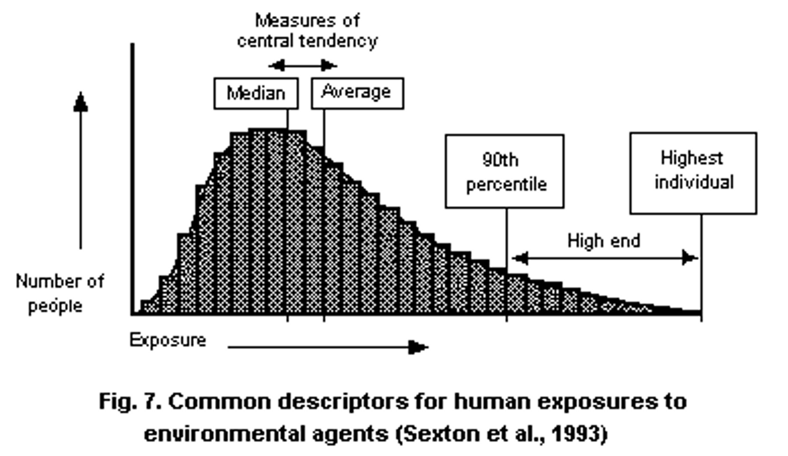{width="600"}

Question: when might we be interested in these specific measures?

------------------------------------------------------------------------

### Common exposure measures

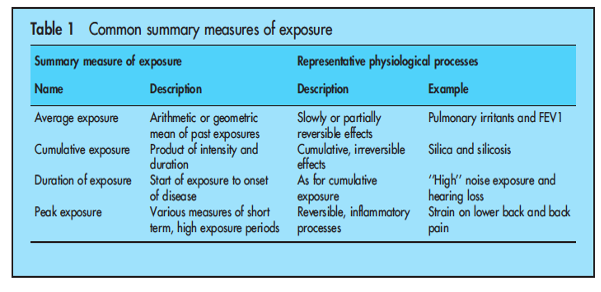{width="600"}

::: {.absolute bottom="0"}
Kriebel, Checkoway, Pearce, 2007
:::

------------------------------------------------------------------------

### Exposure

Are exposures equally harmful if exposure = time x intensity?

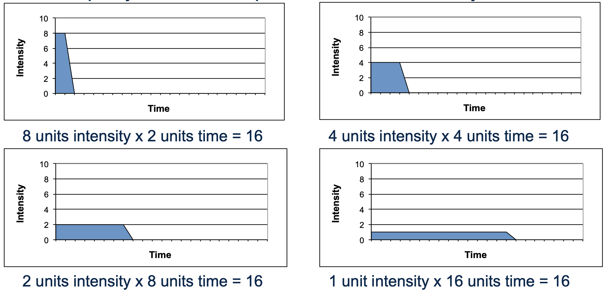{width="600"}

------------------------------------------------------------------------

### We can represent exposure or dose in different ways

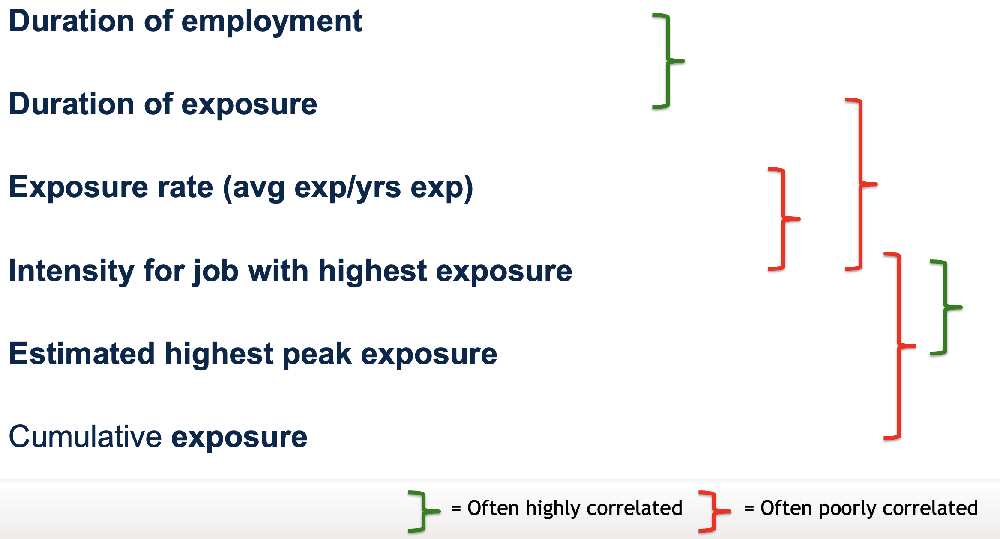{width="600"}

------------------------------------------------------------------------

### Variability in exposure

-   Quantitative and qualitative

-   Results from heterogeneity across people, places, time

    -   Affect precision of exposure estimates and generalizability

-   Types of variability

    -   Spatial: variation due to location

    -   Temporal: variation due to time

    -   Inter-individual: e.g., age, sex, race, activity patterns

    -   Intra-individual: variation in physiology or behavior

-   Cannot be reduced, only better characterized

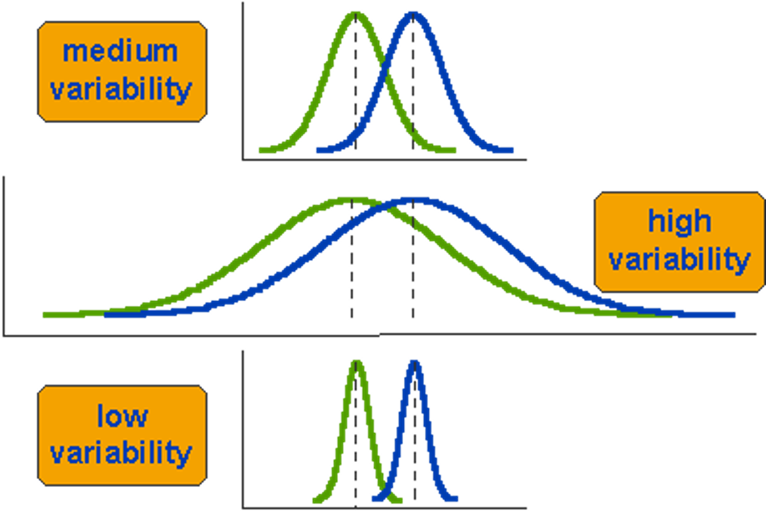{width="300"}

------------------------------------------------------------------------

### Uncertainty in exposure

-   Lack of knowledge about factors affecting exposure or risk of health outcome

-   Results in inaccurate or biased exposure estimates

-   Types of uncertainty

    -   Scenario (information)

    -   Parameter (mathematical)

    -   Model (scientific knowledge)

-   Unlike variability, can be reduced

------------------------------------------------------------------------

### Variability vs uncertainty

-   Difference between variability and uncertainty may not always be clear

-   In general…

    -   Data have variability

    -   Statistics have uncertainty

------------------------------------------------------------------------

### Comparing imperfect measures

Agreement between multiple estimates of exposure

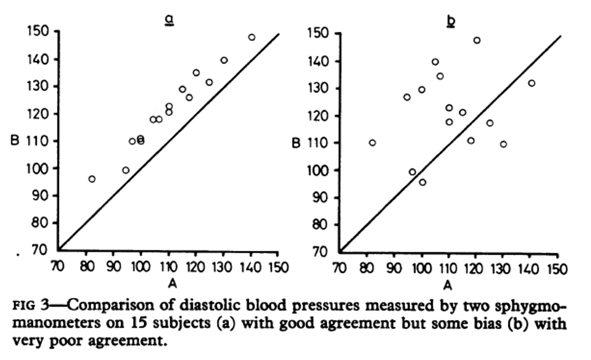{width="450"}

::: {.absolute bottom="0"}
Kaupinen, 1991
:::

------------------------------------------------------------------------

### Methods for exposure analysis

-   Low complexity

    -   Univariate statistics

    -   Bivariate statistics

-   Moderate complexity

    -   ANOVA, non-parametric equivalents

-   High complexity

    -   Modeling

{width="400"}

------------------------------------------------------------------------

### Exposure modeling

-   Deterministic (regression)

    -   Linear

    -   Logistic

    -   Survival (will not address this)

-   Will touch lightly on the following

    -   Probabilistic

    -   Bayesian

    -   Hybrid

------------------------------------------------------------------------

### Accounting for protective behavior

-   Must consider anytime exposed individuals could receive protection from exposure, e.g.

    -   Use of personal protective equipment

    -   Use of protective agents

    -   Change in behavior

------------------------------------------------------------------------

### Exposure-response relationships

-   Will not be a primary focus of class

    -   Will explore a bit to give you complete analysis experience

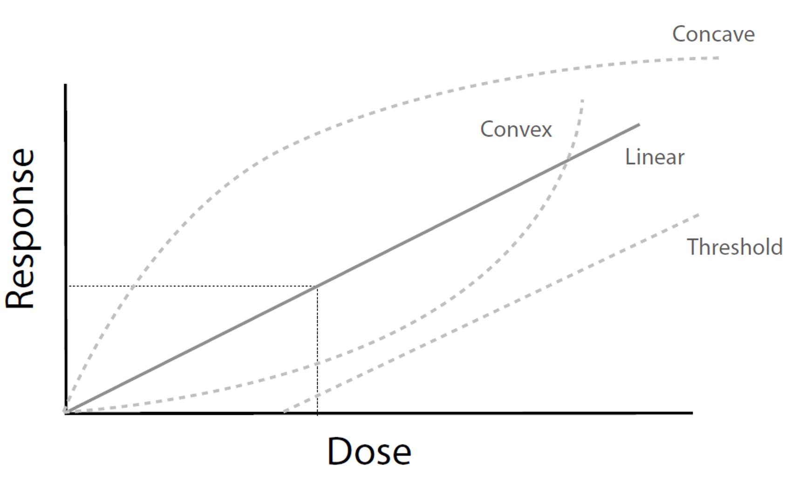{width="500"}

------------------------------------------------------------------------

### Exposure data and risk management

-   Risk analysis synthesizes data from multiple sources to produce interpretable risk estimates

    -   E.g., "worst-case" or "typical" exposure

    -   Made difficult by incomplete, conflicting, or poor quality data

{width="400" height="200"}

::: {.absolute bottom="0"}
Tielemans, Marquart, De Cock, Groenewold, Van Hemmen, 2002
:::

------------------------------------------------------------------------

### Presentation of data and results

-   Best practices for presenting data

    -   Numerical precision

    -   Data visualization

    -   Table formatting

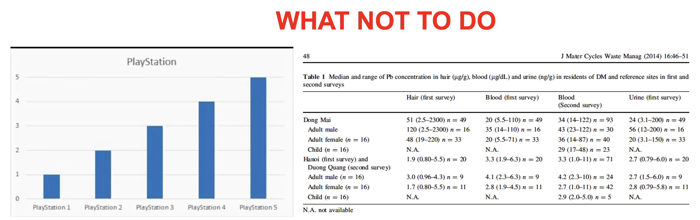{width="500"}

------------------------------------------------------------------------

### Presentation of data and results

Best practices for presenting results

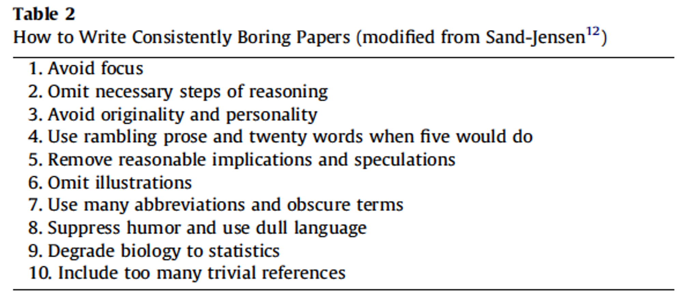{width="500"}

::: {.absolute bottom="0"}
Altman, 1980
:::

------------------------------------------------------------------------

### Conclusions and next session

-   Next session we'll

    -   Talk about the dataset we'll be using, and the study it stemmed from

    -   Start to get acquainted with R

------------------------------------------------------------------------

### Resources

-   EPA Exposure Factors Handbook:<http://www.epa.gov/ncea/efh/pdfs/efh-complete.pdf>

-   Human Exposure Assessment: Environmental Health Criteria 214: <http://www.inchem.org/documents/ehc/ehc/ehc214.htm>
