------------------------------------------------------------------------

## Lecture 2: Introduction and overview, continued

------------------------------------------------------------------------

### Setting the stage

-   So, what exposure will be focusing on this semester?

-   Exposure selected based on…

    -   Ubiquity of exposure (e.g., many sources)

    -   Variability of exposure

    -   Range of health effects

    -   Availability of dataset

    -   Over-emphasis on chemicals at SPH

------------------------------------------------------------------------

### Setting the stage

-   Will use dataset of noise exposures and two health outcomes related to noise

    -   Hearing loss

    -   Hypertension

-   Concepts from this analysis can be readily applied to

    -   Any hazard

    -   Workplace and community exposures

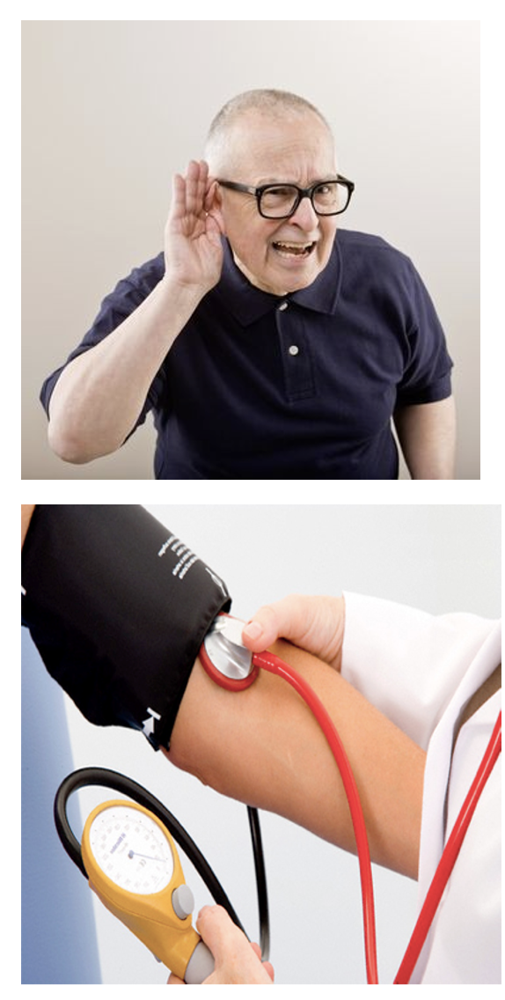{width="200"}

------------------------------------------------------------------------

### Noise and associated health effects

-   Noise among most common occupational exposures

-   Noise-induced hearing loss (NIHL) among most common, well-understood occupational diseases

    -   100% preventable, but permanent, irreversible

    -   Profound social and occupational effects

    -   Most understanding based on continuous noise exposure

    -   Time course of NIHL from variable noise unclear

-   Non-auditory effects of noise less well-understood

    -   Hypertension, ischemic heart disease, etc

    -   Most understanding based on continuous noise exposure

------------------------------------------------------------------------

### Noise and hearing loss

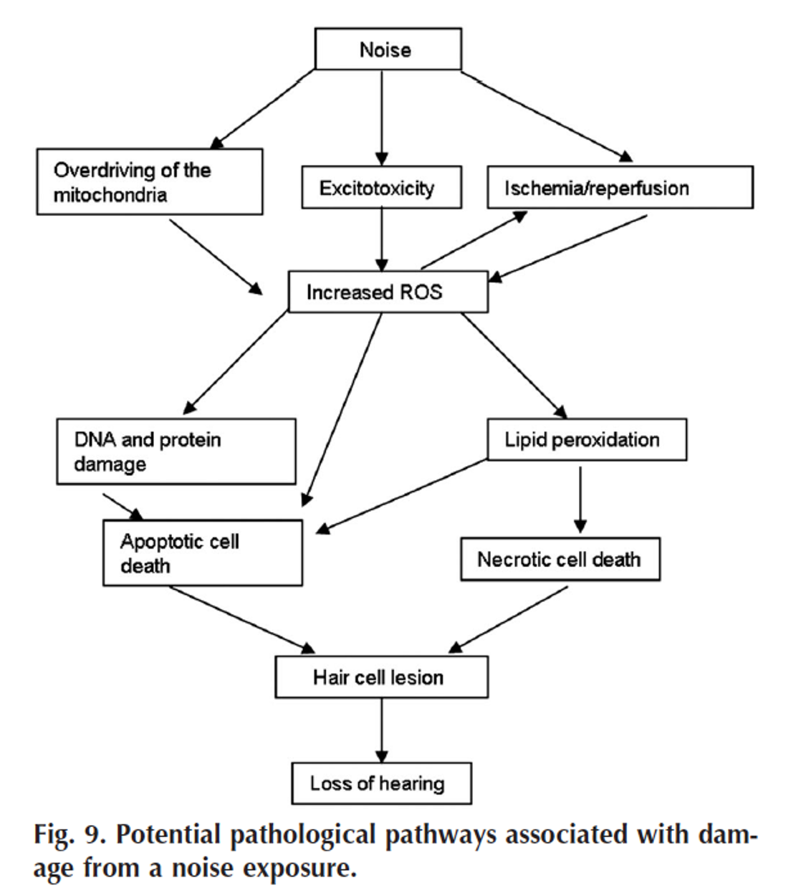{width="400"}

::: custom-footer
Henderson D et al, *Ear Hear* 2006
:::

------------------------------------------------------------------------

### Noise and hearing loss

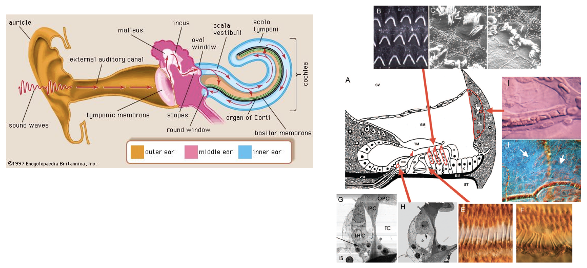{width="90%"}

::: custom-footer
Henderson D et al, *Ear Hear* 2006
:::

------------------------------------------------------------------------

### Noise and hearing loss

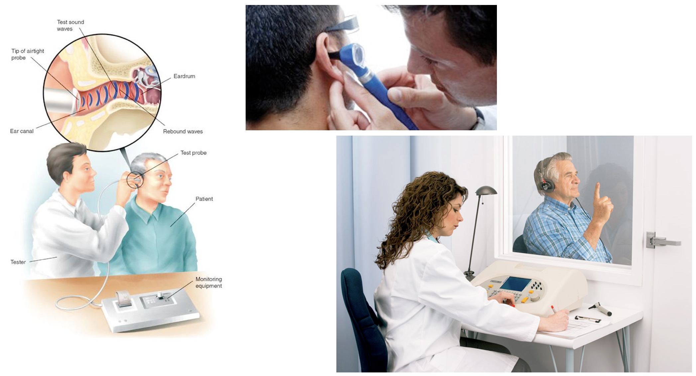{width="90%"}

------------------------------------------------------------------------

### Noise and hearing loss

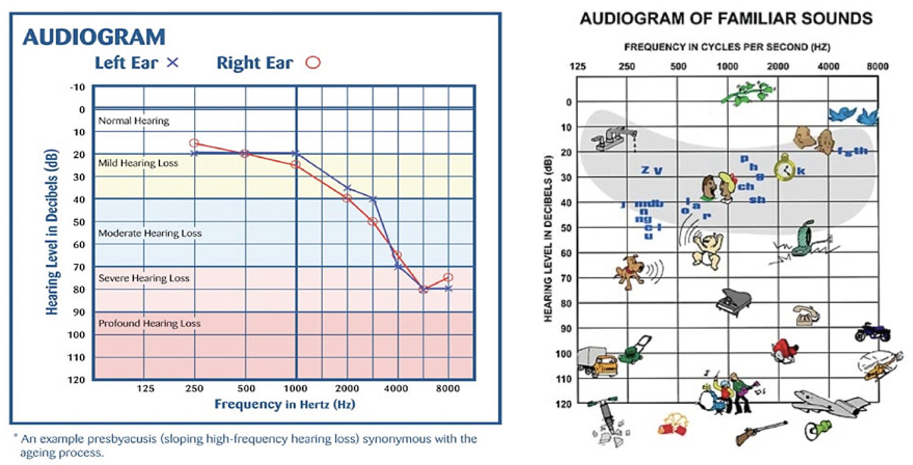{width="90%"}

------------------------------------------------------------------------

### Noise and hearing loss

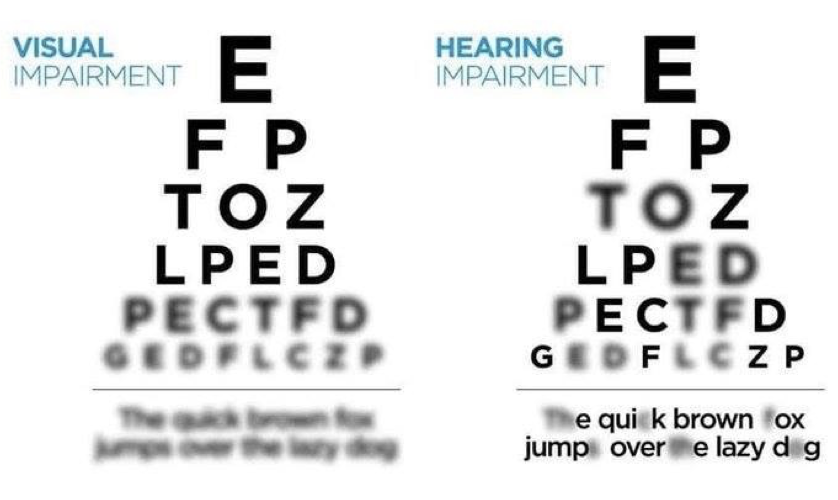{width="90%"}

------------------------------------------------------------------------

### Noise and CVD

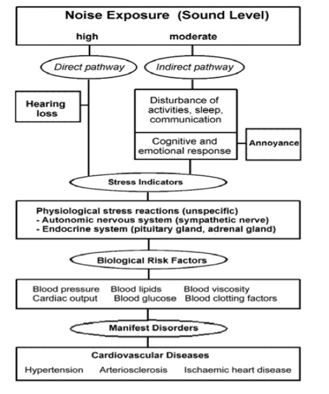{width="50%"}

::: custom-footer
Babisch W, *Noise Health* 2004
:::

------------------------------------------------------------------------

### Environmental noise and CVD

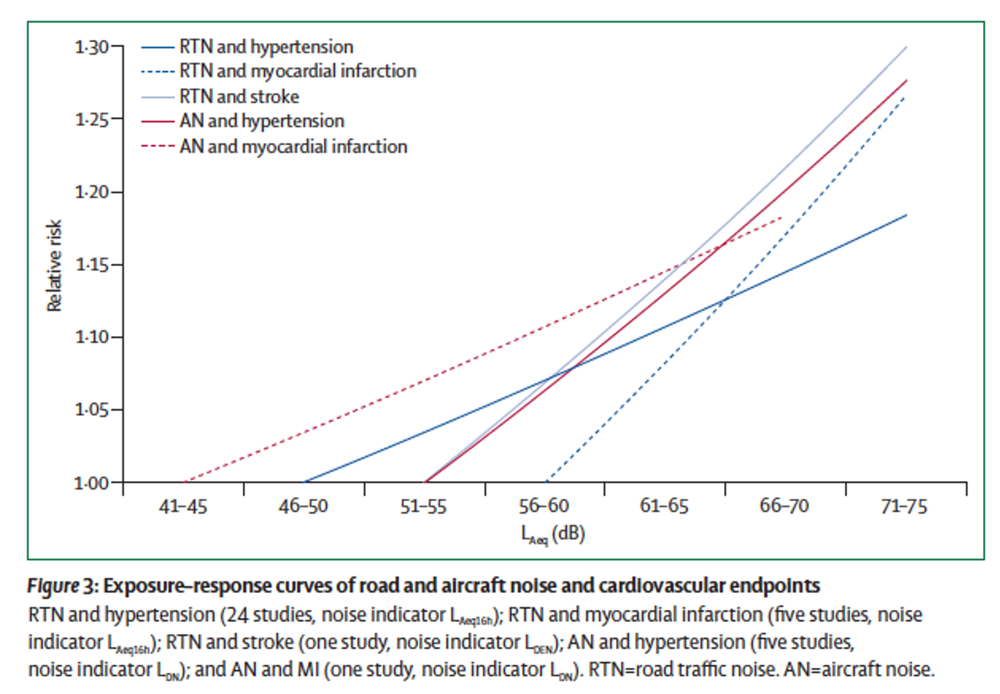{width="70%"}

::: custom-footer
Basner et al, *Lancet*, 2014
:::

------------------------------------------------------------------------

### Environmental noise and CVD

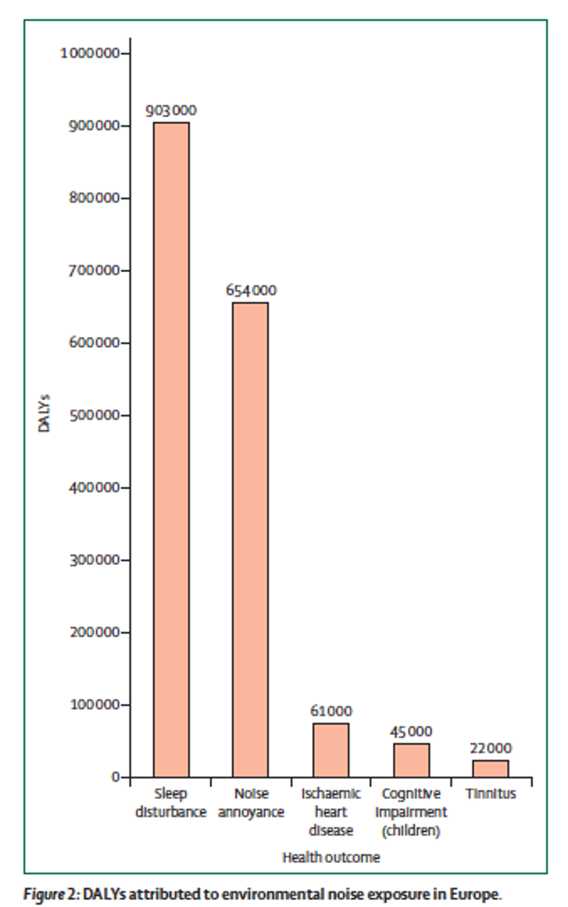{width="10%"}

::: custom-footer
Basner et al, *Lancet*, 2014
:::

------------------------------------------------------------------------

### Continuous occupational noise and CVD

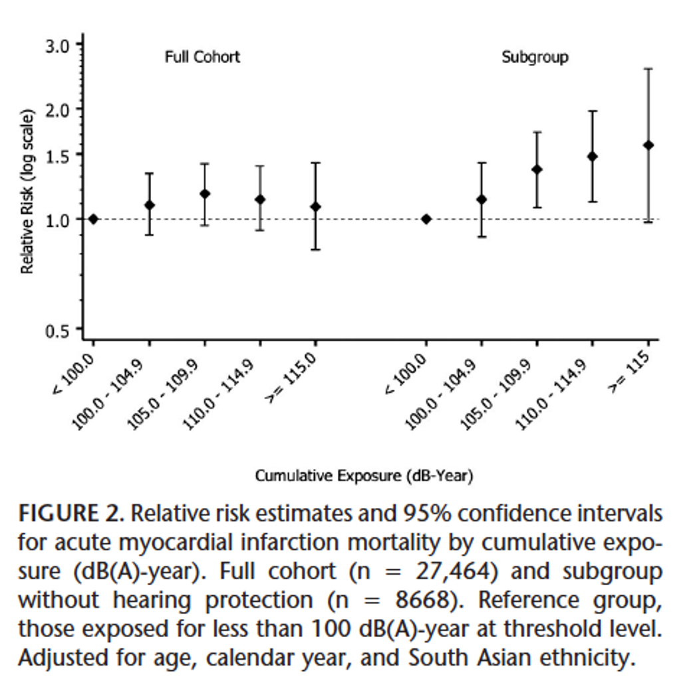{width="60%"}

::: custom-footer
Davies et al, *Epidemiol*, 2005
:::

------------------------------------------------------------------------

### One way to assess CVD: blood pressure

-   Measured using 2 numbers (e.g., 120 over 80 or 120/80)

-   First number = [**systolic**]{.underline} blood pressure

    -   Measures the pressure in blood vessels when heart beats

-   Second number = [**diastolic**]{.underline} blood pressure

    -   Measures pressure in blood vessels when heart rests between beats

::: {style="color: red;"}
-   For EHS 655, hypertension is SBP ≥140 or DBP ≥ 90
:::

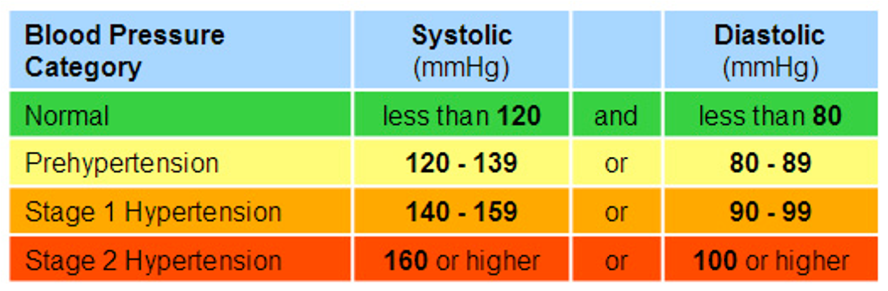{width="30%"}

::: custom-footer
<https://www.cdc.gov/bloodpressure/measure.htm>
:::

------------------------------------------------------------------------

### Okay, so noise is bad. Why do we need another study?

Anyone know Hill's Criteria for Causality?

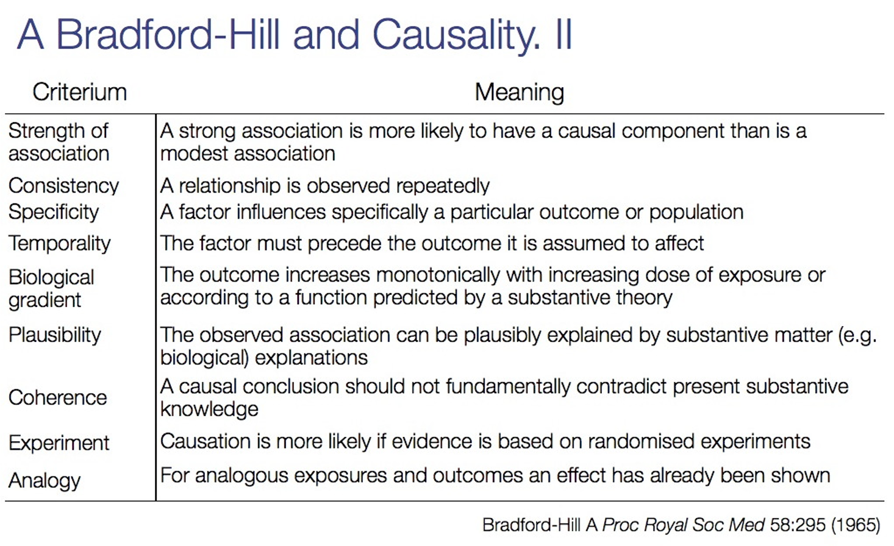{width="60%"}

::: custom-footer
<http://nfs.unipv.it/nfs/minf/dispense/patgen/lectures/files/disease_causality.html>
:::

------------------------------------------------------------------------

### NIHL claims in one industry with highly variable noise

7.5% workforce 1984-96, 21% accepted NIHL claims

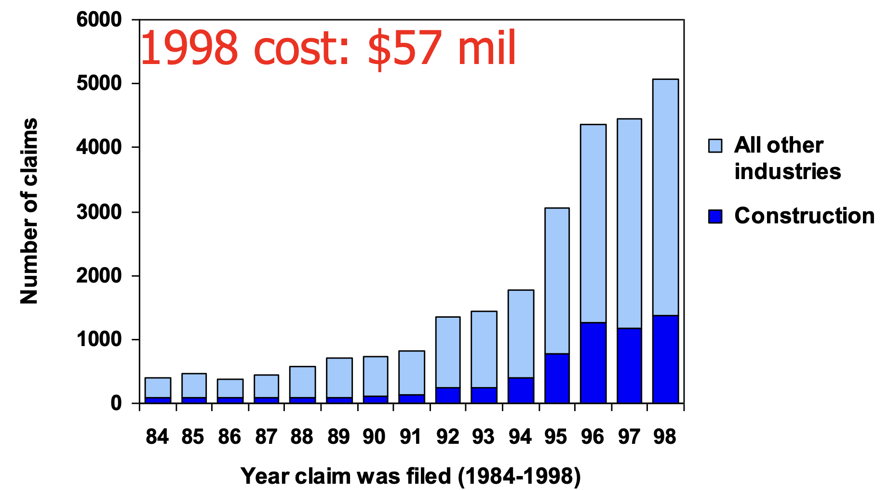{width="60%"}

::: custom-footer
Daniell, Fulton-Kehoe, Cohen, Swan, Franklin, 2002
:::

------------------------------------------------------------------------

### Overview of study (some of) our data come from

-   Prospective study of early NIHL among construction workers, 2000-2010

    -   Why are studies like this rare?

-   Workers recruited at start of apprenticeship programs

-   Annual subject visit to University of Washington, Seattle with:

    -   Extensive battery of hearing tests, blood pressure test

    -   Survey of work experience, tasks, perceptions of exposure

-   Direct exposure measurements on cohort infeasible

------------------------------------------------------------------------

### Data needed to understand risk of health effects of noise

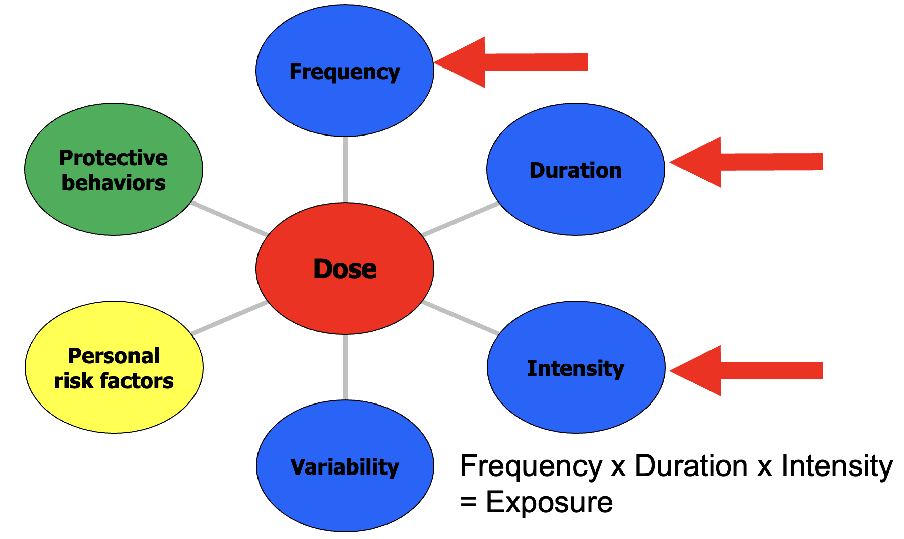{width="70%"}

------------------------------------------------------------------------

### Exposure assessment in construction

{width="90%"}

------------------------------------------------------------------------

### Challenges related to scope of "big" exposure data

-   Full-shift dosimetry measurements from 70-140 dBA

    -   Convenience sample of construction workers at sites around Puget Sound

    -   Shifts not all exactly 8 hours

-   Dosimeters datalog exposure parameters at 1-min intervals

    -   Average level (L~EQ~) in dBA

    -   Maximum level (L~MAX~) in dBA

-   Workers simultaneously record tasks, hearing protector use, etc.

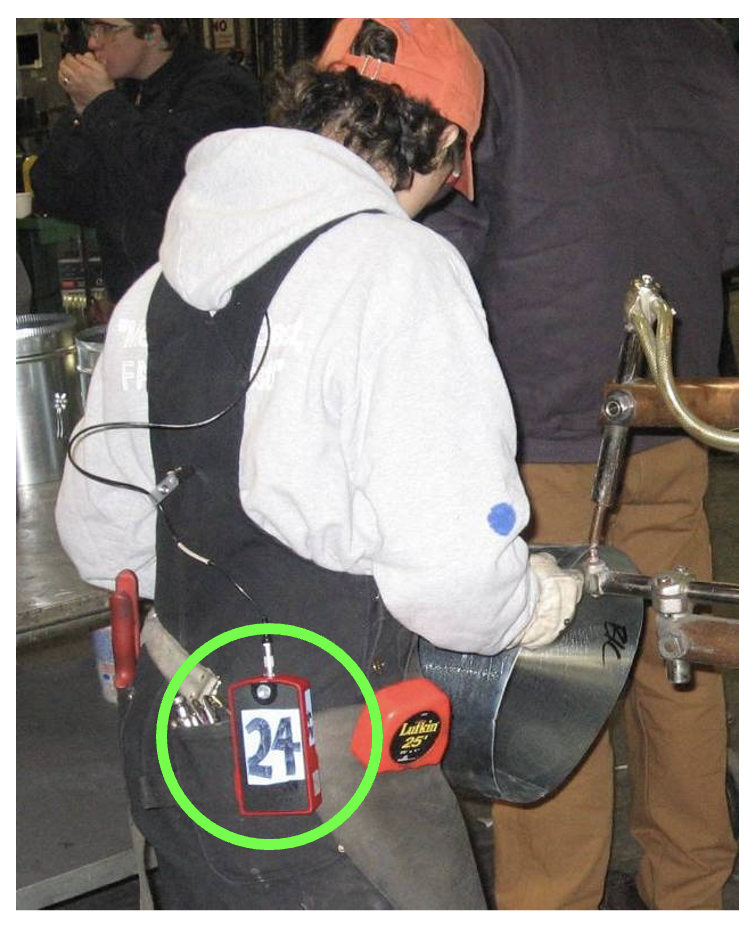{width="15%"}

------------------------------------------------------------------------

### Task-based exposure assessment

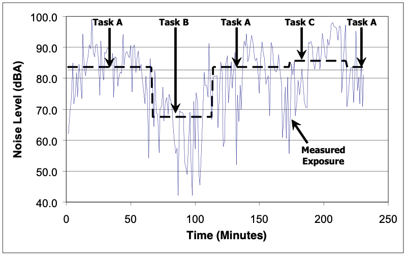{width="70%"}

------------------------------------------------------------------------

### Subjective rating (SR) of noise exposure

-   Workers assess own noise exposure via SR

    {width="70%"}

-   Simultaneously measure noise exposure

-   Combine for quantitative exposure estimate

::: custom-footer
Neitzel, Daniell, Sheppard, Davies, Seixas, 2009
:::

------------------------------------------------------------------------

### Data needed to understand risk of health effects of noise

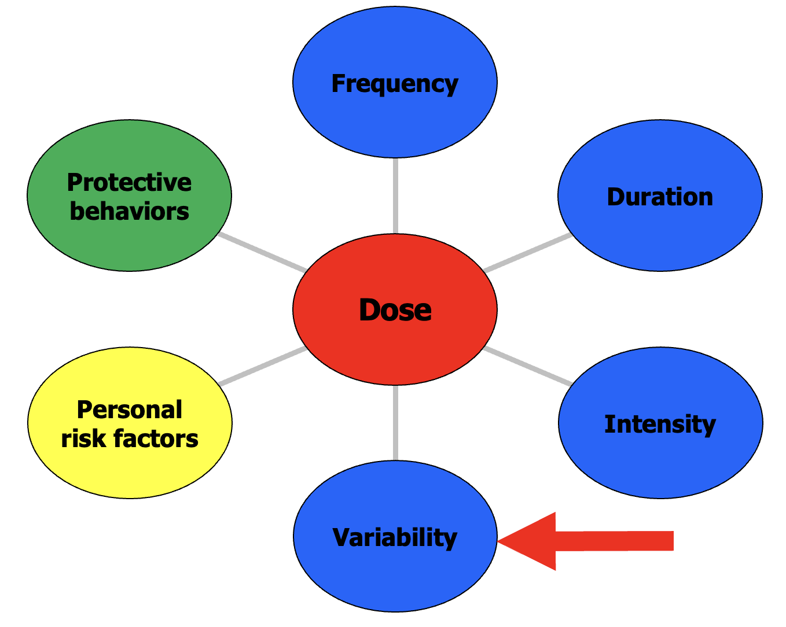{width="70%"}

------------------------------------------------------------------------

### Variability - alternative metrics

-   Different exposure parameters may help explain health effects

    -   Average

    -   Maximum or peak

-   Can also compute ratios of these parameters

    -   Maximum/average (peakiness of levels)

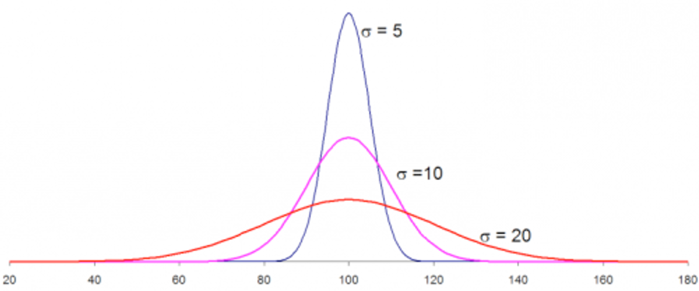{width="30%"}

::: custom-footer
Seixas, Sheppard, Neitzel, 2005; Rappaport, 1991
:::

------------------------------------------------------------------------

### Data needed to understand risk of health effects of noise

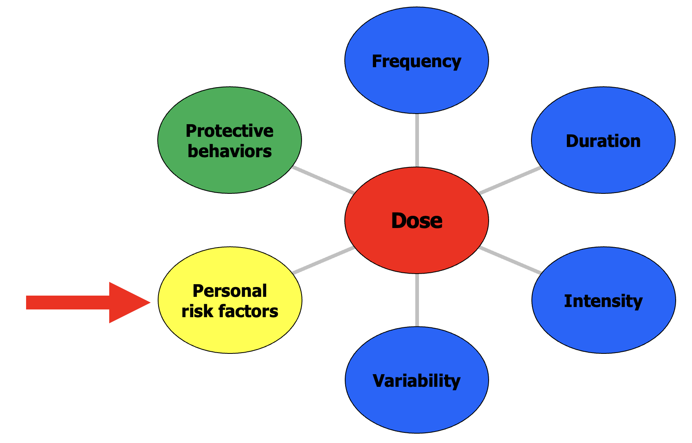{width="70%"}

------------------------------------------------------------------------

### Example sources of noise in daily life

{width="90%"}

------------------------------------------------------------------------

### Example sources of noise in daily life

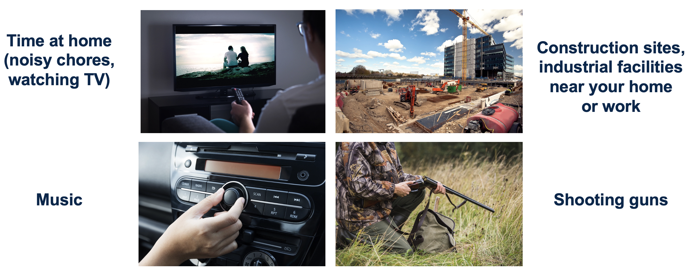{width="90%"}

------------------------------------------------------------------------

### Common noise complaints

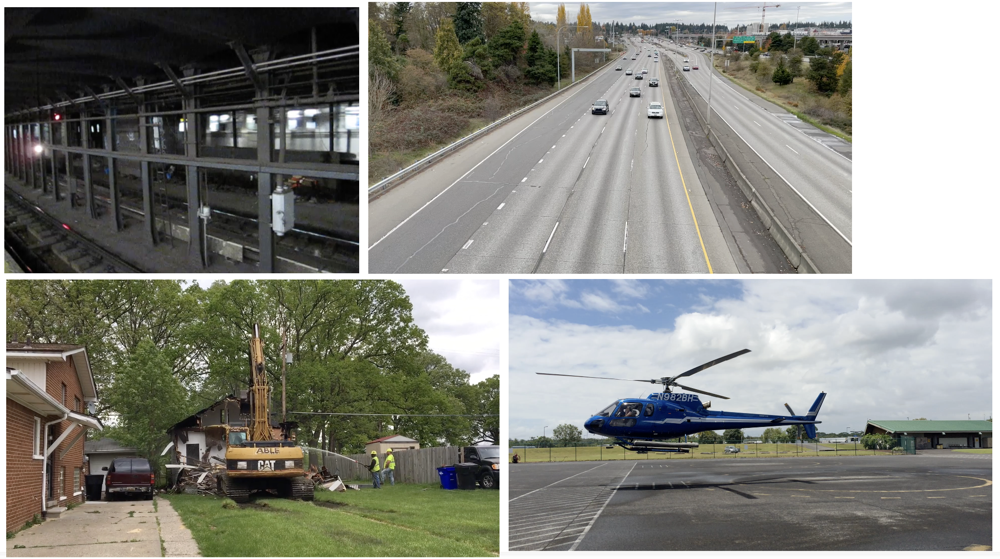{width="80%"}

------------------------------------------------------------------------

### Data needed to understand risk of health effects of noise

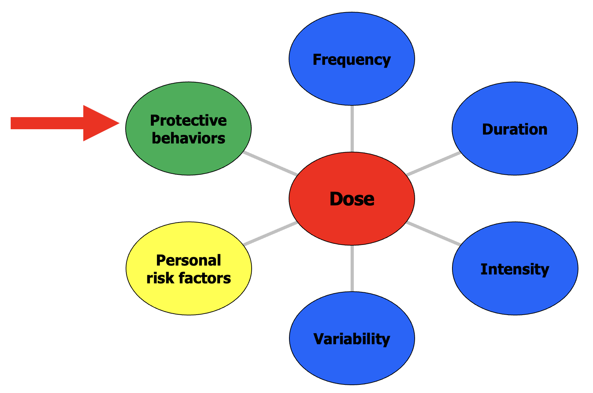{width="70%"}

------------------------------------------------------------------------

### Factors to consider regarding use of hearing protectors

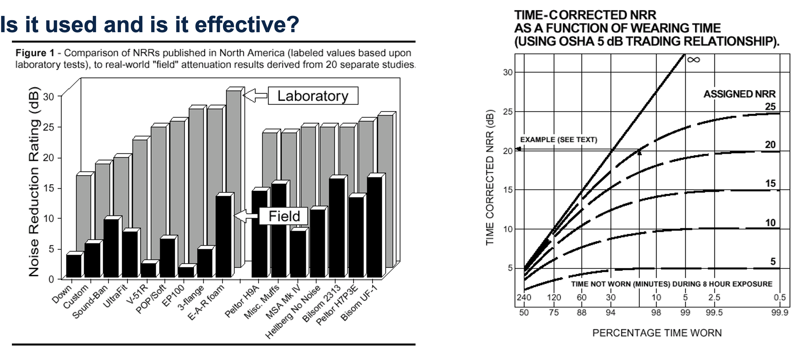{width="90%"}

------------------------------------------------------------------------

### Other protective "behaviors"

-   Acoustic reflex

-   Biomarker of exposure and susceptibility

    -   Temporary Threshold Shift at 2 mins post-exposure, TTS~2~

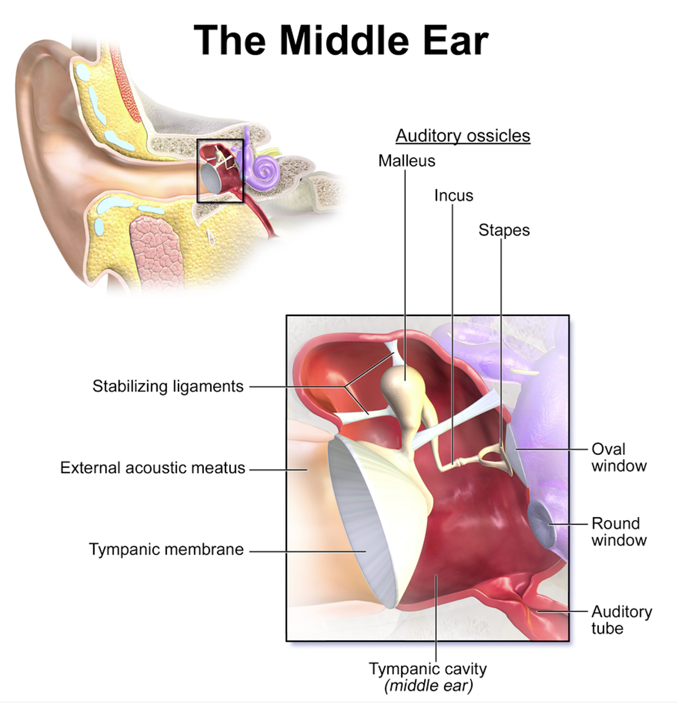{width="30%"}

------------------------------------------------------------------------

### Data needed to understand risk of health effects of noise

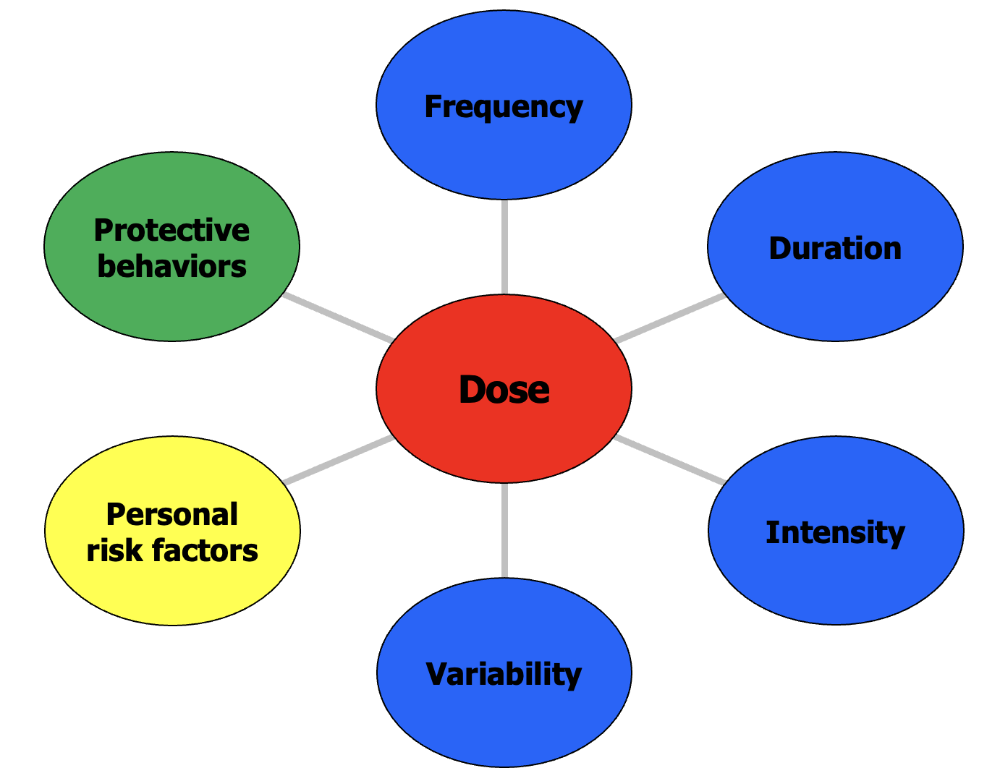{width="60%"}

------------------------------------------------------------------------

### From the reading

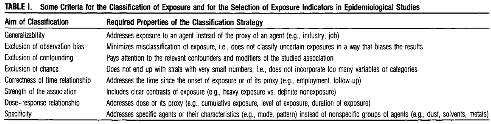{width="80%"}

::: custom-footer
Kauppinen 1991, *Appl Occup Environ Hyg*
:::

------------------------------------------------------------------------

### Introduction to the data files

-   Types of files

    -   Dataset file

    -   Variable description file

-   You’ll be using and referring to both regularly

------------------------------------------------------------------------

### Resources

-   Statistics Consulting Group, University of California-Los Angeles Institute for Digital Research and Education

    -   Which statistical analysis should I use? <https://stats.idre.ucla.edu/other/mult-pkg/whatstat/>

    -   Helpful resources for R <https://stats.oarc.ucla.edu/r/>

-   Getting help with R from the R Project

    -   <https://www.r-project.org/help.html>

-   Search engines will be your best friend for searching for or troubleshooting R commands
