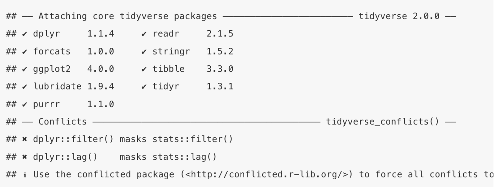
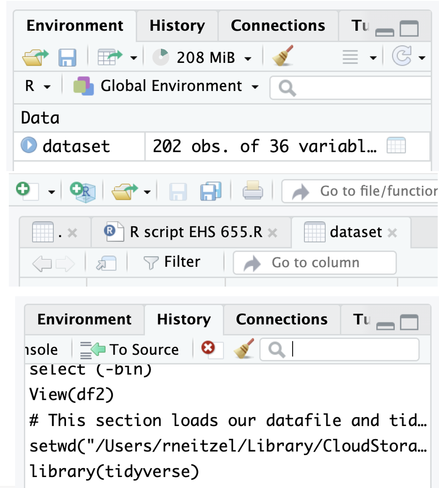
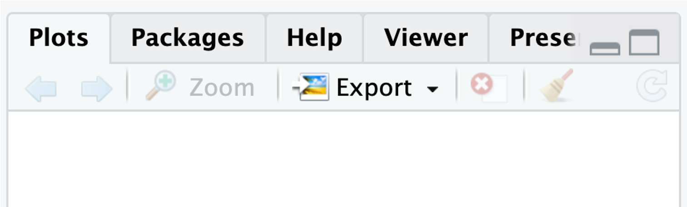

```{r, include = F}
library(tidyverse)
library(readxl)
```

::: {.content-visible when-format="revealjs"}

------------------------------------------------------------------------

## Lecture 3: Reintroduction to R

------------------------------------------------------------------------
:::

### About R

-   R is primarily used for statistical analysis and graphics development, including

    -   Data handling and manipulation

    -   Data analysis

    -   Data visualization

-   R is open source, and anyone can create functions

    -   As a result, R is a composite of *packages* (i.e., set of related functions) that many independent developers created

------------------------------------------------------------------------

### About R Studio

-   While R is a computer language, RStudio is an *Integrated Development Environment* (IDE)

    -   Provides a more user-friendly interface when coding in R

    -   Note! You don’t have to use RStudio to run R code; but it will make it much easier to develop your R code

------------------------------------------------------------------------

### Installing R and RStudio on your computer

This [**is**]{.underline} the recommended approach

-   Choose your operating system and then download and install R from UM's CRAN site:

    -   <https://repo.miserver.it.umich.edu/cran/>

-   Choose your operating system and then download and install R Studio from POSIT:

    -   <https://posit.co/downloads>

-   Then we can start to configure R Studio for your analyses

------------------------------------------------------------------------

### Running R and RStudio remotely via Virtual Sites

This is [**not**]{.underline} the recommended approach

-   Log in to Virtual Sites

    -   <https://its.umich.edu/computing/computers-software/virtual-sites>

-   Get yourself configured to save your files on Virtual Sites

    -   <https://teamdynamix.umich.edu/TDClient/30/Portal/KB/Article/4508/Saving-Files-When-Using-Campus-Computing-or-Virtual-Sites-Configuring-Kumo>

------------------------------------------------------------------------

### Setting your working directory

-   When you first open R, your working directory is your entire computer

-   You can specify a particular folder to work from using the set working directory command

    -   `setwd()`

-   For instance, on a Mac, if my username is “industrialhygiene”, and I have a folder under the file path Documents \> Coding \> EHS655 where I plan to do my R analyses:

    -   `setwd("/Users/industrialhygiene/Documents/Coding/EHS655")`

------------------------------------------------------------------------

### Importing the EHS 655 dataset

-   Now if I read a dataset file (“dataset.csv”) I can simply call the dataset filename directly since my RStudio already knows to look in the “EHS655” folder:

    -   `read.csv(”dataset.csv")`

-   If I did not set my working directory already, I would’ve needed to read the file using the entire file path:

    -   `read.csv("/Users/industrialhygiene/Documents/Coding/EHS655/dataset.csv")`

------------------------------------------------------------------------

### Loading packages in R

-   All functions to run a particular command in R are stored in packages

    -   If you want to install a new package to use additional commands, you will have to install and load them into your environment manually

-   For example, base R does not have the ability to read Excel files. In order to do this, you will have to first download and install the `readxl` package:

    -   `install.packages("readxl")`

-   To load (use) the package you will then use this command:

    -   `library("readxl")`

    -   Note! You will have to run the `library()` command every time you open your RStudio to use the loaded functions.

------------------------------------------------------------------------

### Boolean operators

A form of logical values (i.e., `TRUE` or `FALSE`) using:

-   `>`: greater than
-   `>=`: greater than or equal to
-   `<`: less than
-   `<`: less than or equal to
-   `==`: equal to
-   `!=`: not equal to

------------------------------------------------------------------------

### Tidyverse

-   While base R code is incredibly versatile, most R users utilize the `tidyverse` package for data wrangling, visualization, and simple analysis

-   To install and load the `tidyverse` package:

    -   `install.packages("tidyverse")`

    -   `library("tidyverse")`

        {width="50%"}

------------------------------------------------------------------------

### More on `tidyverse`

The `tidyverse` is package that loads multiple packages that work in harmony with each other.

-   `dplyr` - for data wrangling and manipulation
-   `forcats` - for reordering factor variables
-   `ggplot2` - for data visualization
-   `lubridate` - used for handling date and time data
-   `purrr` - a functional programming toolkit
-   `readr` - for reading reading data files
-   `stringr` - for handling string variables
-   `tibble` - provides better formatting for data frames
-   `tidyr` - provides tools to handle tibble-formatted data frame

------------------------------------------------------------------------

### Exploring `tidyverse` with air quality data

To demonstrate the basic features of the tidyverse packages, we will use the `airquality` dataframe that is pre-loaded into base R

We will store this dataframe under the name `aq_df`

```{r}
aq_df <- datasets::airquality
```

------------------------------------------------------------------------

### Air quality example: data frame and tibble

Let's view what the dataset looks like

```{r}
head(aq_df)
```

We can view what *class* of dataset this is

```{r}
class(aq_df)
```

This shows the dataset is stored in R as a `data.frame`, not a `tibble`. We can change this using the `as_tibble()` function

```{r}
aq_df <- as_tibble(aq_df)
```

Pro tip: use the up arrow in the command line to scroll to last command

------------------------------------------------------------------------

### So, what's a dataframe, and what's a tibble?

Data frame

-   Two-dimensional, table-like data structure designed to store tabular data

-   Columns can contain different data types like numeric, character, logical, etc.

-   Each individual column must have the exact same type of data in all of its rows

-   Every column must have a unique name

Tibble

-   Basically what the tidyverse calls a data frame

-   From <https://tibble.tidyverse.org/>:

    -   “Tibbles are data.frames that are lazy and surly: they do less (i.e. they don’t change variable names or types, and don’t do partial matching) and complain more (e.g. when a variable does not exist). This forces you to confront problems earlier, typically leading to cleaner, more expressive code.”

------------------------------------------------------------------------

### Air quality example: arrange function

:::: {.columns-only-on-slides}

::: {.slide-column}
Now, we can check the class of the dataset to see if it is a tibble:

```{r}
class(aq_df)
```

Now we can start exploring and manipulating this dataset

First, let's sort data by ascending temperature using the `arrange()` function

```{r}
arrange(aq_df, Temp)
```
:::

::: {.slide-column}
Or, we could sort by descending temperature by adding a minus (-) sign

```{r}
arrange(aq_df, -Temp)
```
:::
::::

------------------------------------------------------------------------

### Air quality example: select function

:::: {.columns-only-on-slides}
::: {.slide-column}
We can also sort by multiple columns (e.g., day and then month

```{r}
arrange(aq_df, Day, Month)
```

We can also keep or remove specific columns using the `select()` function. To remove the solar radiation column:

```{r}
select(aq_df, -Solar.R)
```
:::

::: {.slide-column}
Or, if there are specific columns we want to keep (e.g., ozone, month, day), we can list them:

```{r}
select(aq_df, Ozone, Month, Day)
```
:::
::::

------------------------------------------------------------------------

### Air quality example: filter and mutate functions

:::: {.columns-only-on-slides}
::: {.slide-column}
In addition to removing columns, we can also remove specific rows using the `filter()` function. For example, to look only at the month of May:

```{r}
filter(aq_df, Month == 5)
```

*Note: we can check the N of rows (which started at 153, now down to 31) to confirm the change was made*
:::

::: {.slide-column}
We can also create new columns using the `mutate()` function. Let's create an indicator variable for days when ozone is greater than 30:

```{r}
mutate(aq_df, Ozone_above_30 = ifelse(Ozone > 30, 1, 0))
```

*Note: the command sets the variable to `1` if ozone \>30, otherwise to `0`*
:::
::::

------------------------------------------------------------------------

### Air quality example: the pipe operator (`%>%`)

:::: {.columns-only-on-slides}
::: {.slide-column}
To arrange, select, filter, and mutate data all in one line of code, we could use:

```{r}
mutate(filter(select(arrange(aq_df, -Temp), -Solar.R), Month == 5), Ozone_above_30 = ifelse(Ozone > 30, 1, 0))
```

*Note: this is difficult to read and debug, and has a weird order of operations*
:::

::: {.slide-column}
With the pipe operator (`%>%`), we can separate command sequentially:

```{r}
arrange(aq_df, -Temp) %>% 
  select(-Solar.R) %>% 
  filter(Month == 5) %>% 
  mutate(Ozone_above_30 = ifelse(Ozone > 30, 1, 0))
```

Much better! Need to be cognizant of order of operations (i.e., filter before mutating)
:::
::::

------------------------------------------------------------------------

### Now let's look at our data. First stop: the R script

-   What is an R script?

    -   It’s a blank R file that will allow you to execute commands in a sequential manner

-   Why use a script?

    -   Ease of manipulation of data

    -   Documentation of manipulations and analyses

    -   Preserve original data file

    -   I’m forcing you to

-   **Pro tip: work along with me in your R script and SAVE YOUR CHANGES**

------------------------------------------------------------------------

### Creating an R script

-   Create a new file, type R script

-   First thing to do is set the working directory. Example:

    -   `setwd("/Users/rneitzel/Library/CloudStorage/Dropbox-UniversityofMichigan/Rick Neitzel/R Workshop")`

    -   Note: this is for a Mac; Windows format will look different

-   Next, let’s make sure tidyverse is installed:

    -   `install.packages("tidyverse")`

    -   Note: when to use quotation marks in R is still a mystery to me; we’ll get through it!

------------------------------------------------------------------------

### Creating an R script

-   Next we want to actually use the `tidyverse` and `readxl` packages

    ```{r, eval=FALSE}
    library(tidyverse)
    library(readxl)
    ```

-   Pro tip for R scripts: document, document, document

    -   You can do this by placing a `#` in front of your text to tell R this is a note, not code

    -   R will recognize this and display text after the `#` in green

    -   Example:

        ```{r}
        # This section loads our datafile and tidyverse 
        ```

-   Now we can load our data file

    ```{r}
    ehs655 <- read_xlsx("Dataset V1.xlsx")
    ```

    -   Note: R will look for this file in your working directory; make sure it’s saved there!

------------------------------------------------------------------------

### Creating an R script

Now let's save our dataframe as a tibble

```{r}
ehs655 <- as_tibble(ehs655)
```

Congratulations! Our dataset is loaded and ready for exploration

Some basic exploration

```{r}
head(ehs655)
```

------------------------------------------------------------------------

### Exploring the dataset

R can show us what's in the dataset graphically

You can also see all of the commands you've run in this R session

{width="30%"}

------------------------------------------------------------------------

### Let's interact with the data a bit

Let's limit the number of variable we're looking at to just the first 8

```{r}
ehs655 <- ehs655 %>% 
  as_tibble() %>% 
  select(`Subject-ID`, `Job-title`, `Measurement date`, `Site-type`,  County, `Age-baseline-years`, `Work-LEQ-dBA`)
```

*Note: we can select any number and selection of variables this way*

*Note: we don’t have to save changes (first line) – just showing this for clarification for when you do might want to save changes (for instance, when you create a permanent new variable)*

*Note: when there are spaces and weird symbols in a column name (e.g., a dash), you have to use the backward tick symbol (\`) around your column name to call it. Otherwise, you don't need it (like when we call the County variable). We will discuss how to clean up column names later.*

Now let's sort by measurement date instead of subject ID

```{r}
ehs655 <- ehs655 %>% arrange(`Measurement date`)
```

------------------------------------------------------------------------

### Let's interact with the data a bit

And then back to sorted by subject ID

```{r}
ehs655 <- ehs655 %>% arrange(`Subject-ID`)
```

Display data types

```{r}
str(ehs655)
```

List variable names

```{r}
names(ehs655)
```

Identify unique values in a variable

```{r}
unique(ehs655$`Job-title`)
```

------------------------------------------------------------------------

### Some basic analysis commands in R

:::: {.columns-only-on-slides}
::: {.slide-column}
Summarize all variables

```{r}
summary(ehs655)
```

Calculate specific statistics (more later)

```{r}
mean(ehs655$`Work-LEQ-dBA`)
median(ehs655$`Age-baseline-years`)
sd(ehs655$`Subject-ID`)
```

Note: this last statistic makes no sense at all
:::

::: {.slide-column}
Create a table of unique values in a variable

```{r}
table(ehs655$`Job-title`)
```
:::
::::

------------------------------------------------------------------------

### A few other things about R

Help is available (but a search engine will likely give you better results)

{width="40%"}

------------------------------------------------------------------------

### That's enough for today

Questions?
