```{r, include = F}
# list of packages for this lecture
library(tidyverse)
```

::: {.content-visible when-format="revealjs"}

------------------------------------------------------------------------

## Lecture 4: Types of data, descriptive statistics, censored data, more R

------------------------------------------------------------------------
:::

### What we'll cover today

- The basics

- Types and scales of data

- Descriptive analysis and visualization

  - Distribution

  - Central tendency

  - Dispersion

- Censored data

------------------------------------------------------------------------

### The basics: understanding exposure

{width="70%"}

::: custom-footer
White E, Armstrong BK, Saracci R. 2008
:::

------------------------------------------------------------------------

### Assessing exposures

{width="75%"}

::: custom-footer
Source: Nieuwenhuijsen M. et al, New develpments in exposure assessment: The impact on the practice of health risk assessment and epidemiological studies. Environment International, December 2006, Vol 32 (8) Pgs 996 -1009
:::

------------------------------------------------------------------------

### Exposure data examples

{width="60%"}

------------------------------------------------------------------------

### Exposure data examples

{width="90%"}

::: custom-footer
Ignacio and Bullock, AIHA, 2006
:::

------------------------------------------------------------------------

### Types and scales of data

------------------------------------------------------------------------

### Binary and nominal

- Values only used as labels

  - Binary = two categories

  - Nominal \>= two categories

- Not ordered

  - Tells nothing about individual’s ranking

- Examples?

  ::: fragment
  - Binary: gender

  - Nominal: occupation (if not ordered in some way related to exposure)
  :::

{width="25%"}

::: custom-footer
White E, Armstrong BK, Saracci R. 2008
:::

------------------------------------------------------------------------

### Ordinal

- Values used indicate rank ordering (e.g., low/moderate/high)

- Differences between numbers do not indicate actual size of differences

- Examples?

  ::: fragment
  - Socioeconomic status

  - Crude categories of exposure (e.g., exposed daily, weekly, monthly, yearly)
  :::

::: custom-footer
White E, Armstrong BK, Saracci R. 2008
:::

------------------------------------------------------------------------

### Numeric

- Relative values of assigned numbers reflect true differences in underlying values

- We’ll treat these as “numeric”

- Examples?

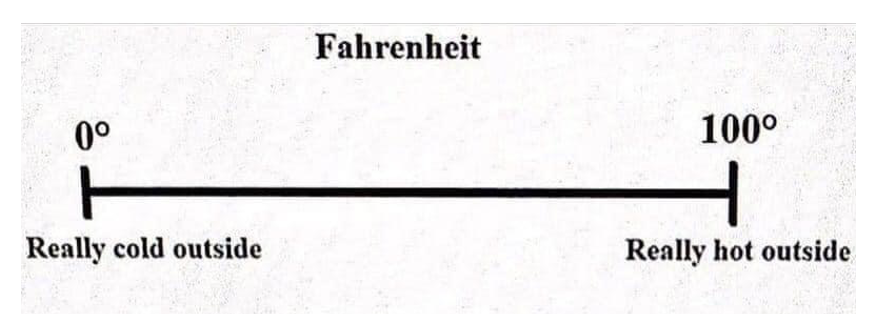{width="20%"}

::: fragment
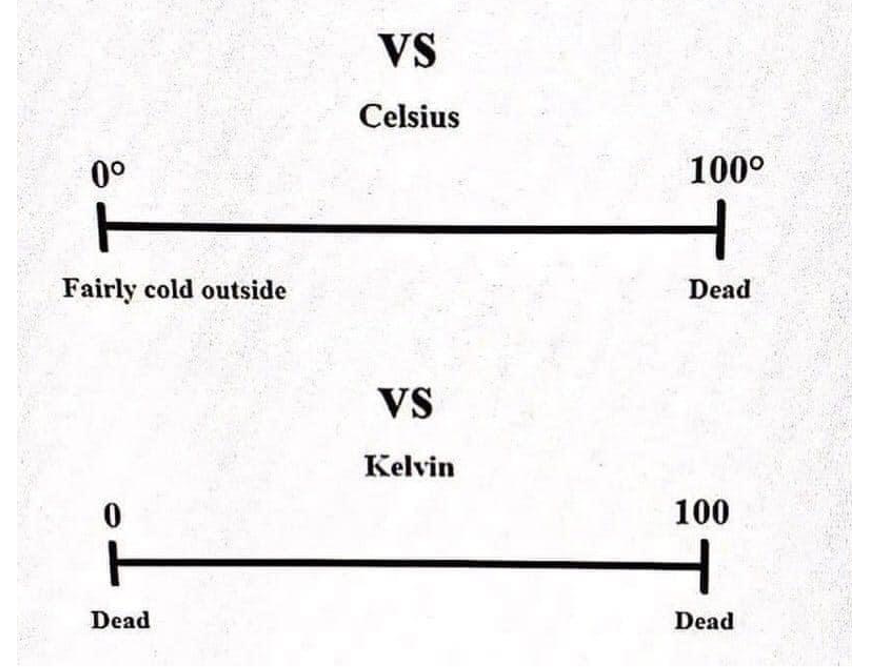{width="20%"}
:::

::: custom-footer
White E, Armstrong BK, Saracci R. 2008
:::

------------------------------------------------------------------------

### Exercise

- Imagine a study of exposure to 1,4 dioxane in drinking water among community members in Ann Arbor

- Think of an example of potentially relevant exposure information for each of following data scales:

  - Binary

  - Nominal

  - Ordinal

  - Numeric

{width="40%"}

------------------------------------------------------------------------

### Data types associated with exposure assessment methods

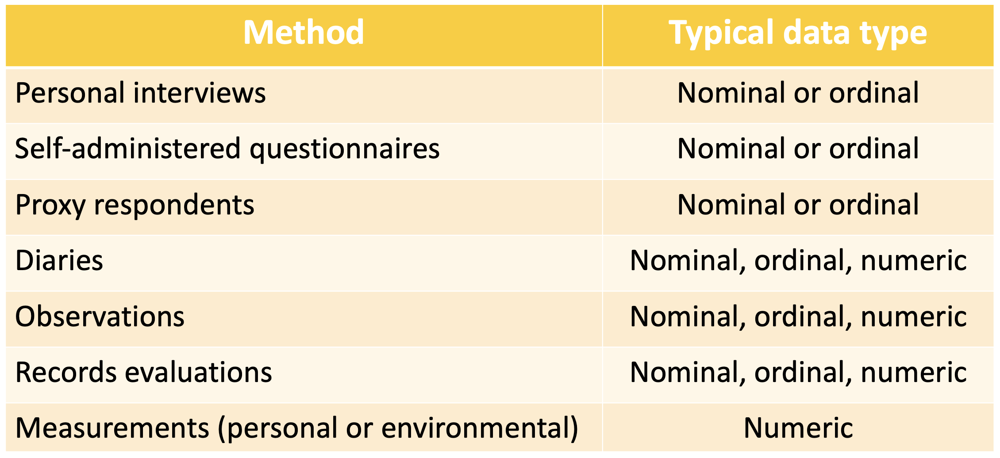{width="70%"}

------------------------------------------------------------------------

### Data that might be available for exposure analysis

{width="90%"}

::: custom-footer
<https://synergist.aiha.org/202012-ih-data-standardization>
:::

------------------------------------------------------------------------

### Tool to help document exposure measurements

AIHA Basic Exposure Assessment and Sampling Spreadsheet

{width="90%"}

Let's explore!

<https://aiha-assets.sfo2.digitaloceanspaces.com/AIHA/resources/Public-Resources/EXASSVG-BasicBCEASamplingCollectionSheet.xls>

------------------------------------------------------------------------

### Tool to help collect information on exposure scenarios

{width="70%"}

Let's explore!

<https://aiha-assets.sfo2.digitaloceanspaces.com/AIHA/resources/Public-Resources/IHEST_V15.xlsm>

***Note: you mus enable Macros in Excel for tool to work***

------------------------------------------------------------------------

### Ramifications of data scales

- When exposures can be quantified, best to capture as quantitative rather than categorical

  - E.g., #cigarettes per day instead of \<14, 15-24, 25-34, etc.

  - Even if categories equally sized, mean value in each category cannot be computed

- Can always collapse quantitative to categorical – but not vice versa

  - May even want to do this, as ordinal is easy to understand, makes no dose-response assumptions

------------------------------------------------------------------------

### Descriptive analysis

- Before we can make inference from data we must thoroughly examine variables

  - Catch mistakes

  - Look for patterns

  - Find violations of statistical assumptions

  - Generate hypotheses

  - Avoid headaches later

{width="10%"}

------------------------------------------------------------------------

### Scope of dataset/analysis

- Univariate

  - Measurements on one variable per subject

- Bivariate

  - Measurements on two variables per subject

- Multivariate (*not today's focus)*

  - Measurements on many variables per subject

------------------------------------------------------------------------

### Univariate analyses

- Characteristics of single variable

- Typically

  - Distribution (frequency distribution)

  - Central tendency (mean, median, mode)

  - Dispersion (range, quartiles, absolute deviation, variance, standard deviation)

------------------------------------------------------------------------

### Distribution: categorical (table)

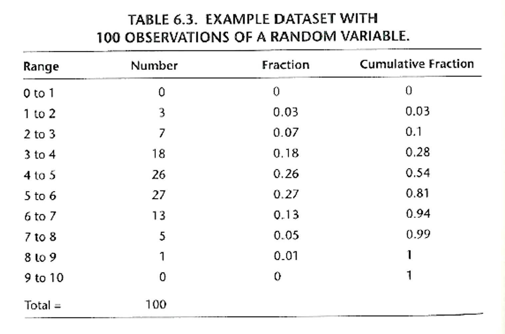{width="60%"}

------------------------------------------------------------------------

### Distribution: categorical (ordinal)

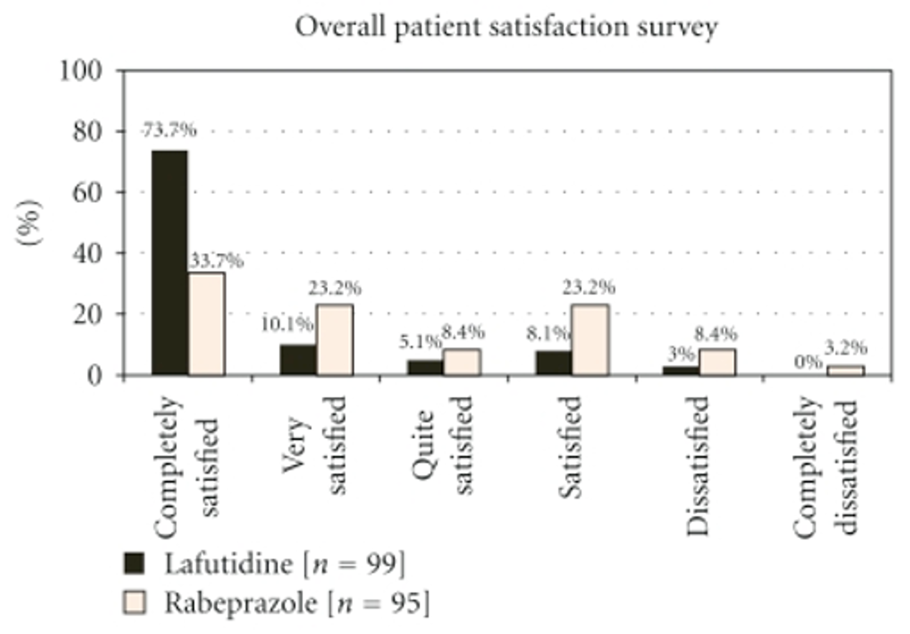{width="60%"}

------------------------------------------------------------------------

### Distribution: quantitative (ratio) histogram

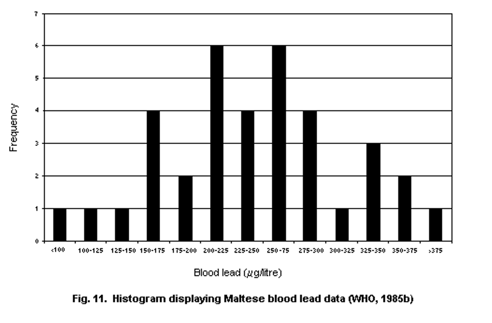{width="60%"}

::: custom-footer
<http://www.inchem.org/documents/ehc/ehc/ehc214.htm>
:::

------------------------------------------------------------------------

### Distribution: exceedance fraction

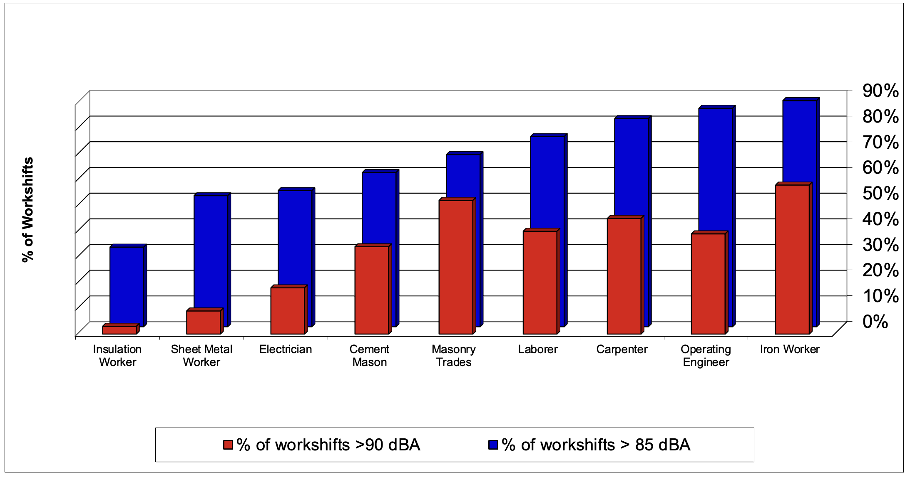

::: custom-footer
<http://www.inchem.org/documents/ehc/ehc/ehc214.htm>
:::

------------------------------------------------------------------------

### Central tendency: mean, median, mode

{width="90%"}

------------------------------------------------------------------------

### Dispersion

- Measures which identify spread of data (i.e., how far measurements are from “center”)

  - [Range]{.underline} (min to max)

  - [Quartiles]{.underline} (Q3 – Q4 is interquartile range, IQR)

  - [Standard deviation]{.underline} (SD) Variance

{width="30%"}

------------------------------------------------------------------------

### Dispersion: standard deviation vs variance

- Standard deviation

  - Not dependent on n

  - Not affected by number of measurements

  - Expressed in same units as data

  - Commonly used in exposure analysis

- Variance is square of standard deviation

  - Squaring eliminates negative values

  - Unit is square of measurement unit (!) – i.e., not same units as data

  - Values farther from mean contribute more to variance

  - Commonly used in exposure analysis

------------------------------------------------------------------------

### Dispersion visualization: boxplot

R: `ggplot(dataset, aes(x = varname1, y = varname2) + geom_boxplot()`

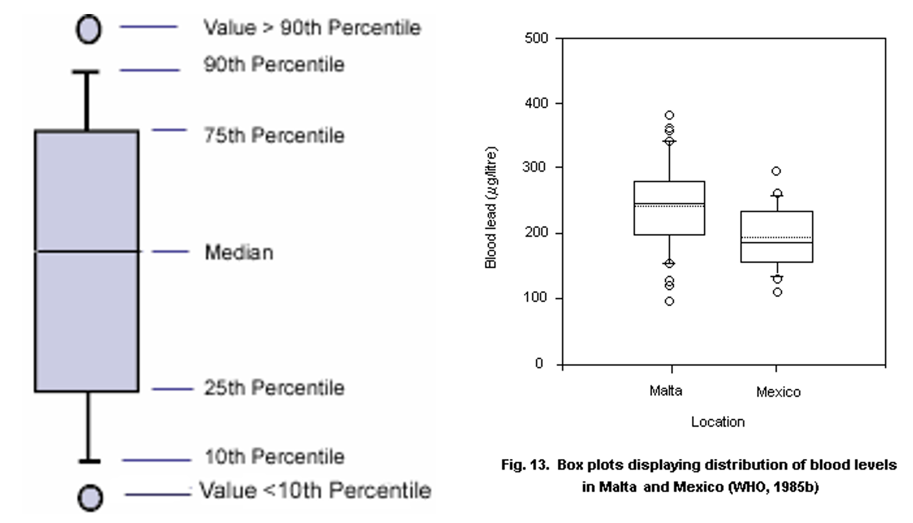{width="50%"}

::: custom-footer
<http://www.inchem.org/documents/ehc/ehc/ehc214.htm>
:::

------------------------------------------------------------------------

### Excel tool available for basic descriptive statistics: IHSTAT

{width="70%"}

::: custom-footer
<https://aiha-assets.sfo2.digitaloceanspaces.com/AIHA/resources/StrategyBook4/Appendix-IV/EXPASSVG-IHSTATmacrofree.xls>
:::

------------------------------------------------------------------------

### Bivariate analyses

- Allow us to begin to explore relationships between variables

  - Scatter plot

  - Correlation

  - Cross-tabulation

------------------------------------------------------------------------

### Bivariate: scatter plot

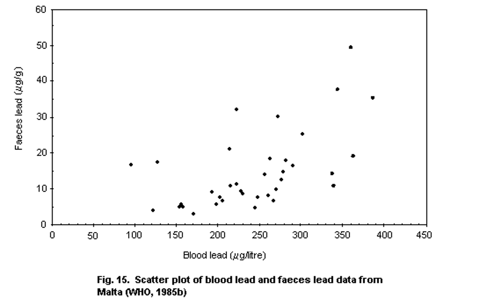{width="70%"}

::: custom-footer
<http://www.inchem.org/documents/ehc/ehc/ehc214.htm>
:::

------------------------------------------------------------------------

### Bivariate: Pearson correlation

- $\rho$ (Pearson’s correlation coefficient) is amount of change in one value you expect from change in another value
- Assumptions:
  - Both variables numeric data
  - Both variables normally distributed
  - Absence of outliers
  - Linear relationship
  - Homeskedasticity

{width="40%"}

------------------------------------------------------------------------

### Bivariate: Spearman correlation

- Spearman’s rank correlation coefficient ($\rho_s$)

  - Pearson correlation coefficient between ranked variables

  - Raw scores $X_i$, $Y_i$ converted to ranks $x_i$, $y_i$

  - Nonparametric (no distributional assumptions)

- Assumptions:

  - Numeric or interval data

  - Monotonic relationship

{width="50%"}

------------------------------------------------------------------------

### Bivariate: Spearman vs Pearson correlation coefficient

{width="90%"}

------------------------------------------------------------------------

### Bivariate: cross-tabulation

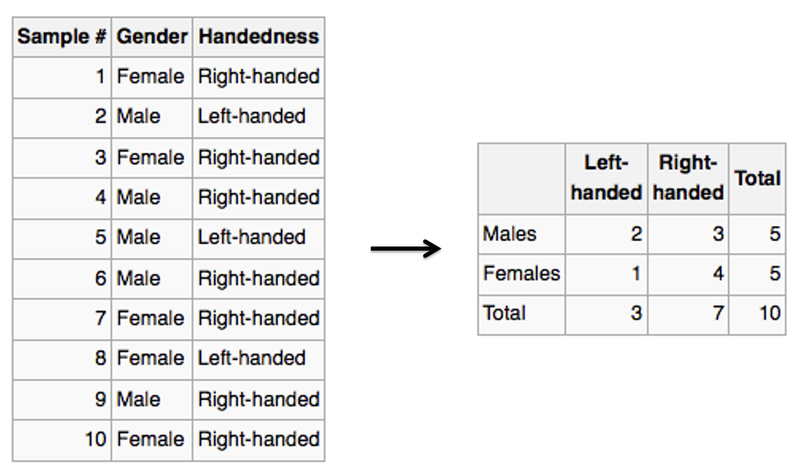{width="60%"}

------------------------------------------------------------------------

### Censored data

::::: columns-only-on-slides
::: slide-column
- Uncensored/complete

  - Value of each sample unit observed/known

  - Default assumption

- Left censored

  - Data \<min value

- Interval censored

  - Data between min and max

- Right censored

  - Data \>max value
:::

::: slide-column
{width="90%"}
:::
:::::

------------------------------------------------------------------------

### Exercise

- Come up with one example of exposure data where you might find each type of censoring

  - Right censoring

  - Left censoring

  - Interval censoring

- One example that’s immediately relevant: our own noise measurements

  - L~EQ~ measured from 70-140 dBA

  - Minutes with levels that never exceed 70 dBA assigned 0 dBA

  - Shifts with mixture of minutes above and below 70 dBA may yield shift average \<70 dBA

------------------------------------------------------------------------

### Common approach #1 to dealing with censored data

::::: columns-only-on-slides
::: slide-column
$$
\frac{LOD}{2}
$$

Assign all censored data 1/2 LOD

Assumes data uniformly distributed below LOD
:::

::: columns-only-on-slides
{width="75%"}
:::
:::::

------------------------------------------------------------------------

### Common approach #2 to dealing with censored data

::::: columns-only-on-slides
::: slide-column
Hornung and Reed (1990)

$$
\frac{LOD}{\sqrt2}
$$

More accurate than LOD/2 when datanormally or lognormally distributed

- Okay if \<\~50% data censored if low to moderate variability

- Less accurate than LOD/2 for highly skewed data
:::

::: columns-only-on-slides
{width="75%"}
:::
:::::

------------------------------------------------------------------------

### Better approach #3 to dealing with censored data

- "$\beta$-substitution method” (Hewett and Ganser 2010)

  - Basically computes a $\beta$ factor for each specific dataset that can be used instead of $LOD/2$ or $LOD/\sqrt2$

  - Minimum $N$ for this equation should be ≥5 when data are censored up to 50%

------------------------------------------------------------------------

### On to R!

Get the data ready again

```{r}
# load packages we need
library(tidyverse)
library(readxl)

# read dataset excel file
ehs655 <- read_xlsx("Dataset V1.xlsx")
```

------------------------------------------------------------------------

### Distributions

::::: columns-only-on-slides
::: slide-column
Distribution: categorical (table) - table function

```{r}
table(ehs655$`Job-title`)
```

Categorical (ordinal) - boxplot function

```{r}
ggplot(ehs655, aes(x = factor(`Job-title`), y = `Work-LEQ-dBA`)) + 
  geom_boxplot(outlier.shape = NA)

```

OR

```{r}
ehs655 %>%
  ggplot() +
  geom_boxplot(aes(x = `Job-title`, y = `Work-LEQ-dBA`))
```
:::

::: slide-column
Quantitative (histogram) - histogram function

```{r}
ehs655 %>%
  ggplot(aes(x = `Work-LEQ-dBA`)) +
  geom_histogram()
```
:::
:::::

------------------------------------------------------------------------

### Calculating mean and median (mode from frequency table)

::::: columns-only-on-slides
::: slide-column
Table function for mean and median

```{r}
ehs655 %>% 
  summarise(mean_leq= mean(`Work-LEQ-dBA`, na.rm = TRUE),
            median_leq = median(`Work-LEQ-dBA`, na.rm = TRUE))
```

Quantitative (histogram) - histogram function

```{r}
ehs655 %>% 
  summarise(sd_leq = sd(`Work-LEQ-dBA`, na.rm = TRUE), 
            iqr_leq = IQR(`Work-LEQ-dBA` , na.rm = TRUE),
            var_leq = var(`Work-LEQ-dBA`, na.rm = TRUE),
            min_leq = min(`Work-LEQ-dBA`, na.rm = TRUE),
            max_leq = max(`Work-LEQ-dBA`, na.rm = TRUE))
```
:::

::: slide-column
And of course these could be combined in a single table
:::
:::::

------------------------------------------------------------------------

### Calculating mean and median (mode from frequency table)

::::: columns-only-on-slides
::: slide-column
Scatterplot

```{r}
ehs655 %>%
  ggplot(aes(`Work-LEQ-dBA`, y = `Age-baseline-years`)) +
  geom_point()
```

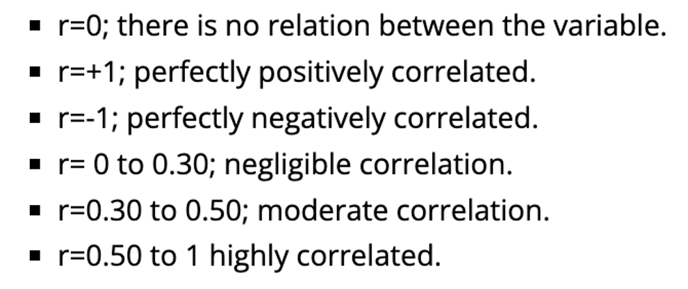{width="40%"}
:::

::: slide-column
Pearson correlation coefficient

```{r}
cor.test(x = ehs655$`Work-LEQ-dBA`, y = ehs655$`Age-baseline-years`)
```

Spearman correlation coefficient

```{r}
cor.test(x = ehs655$`Work-LEQ-dBA`, y = ehs655$`Age-baseline-years`, method = "spearman")
```
:::
:::::

------------------------------------------------------------------------

### Bivariate: cross-tabulation

Use the `xtabs` function

```{r}
xtabs(~`Job-title` + `Gender`, data = ehs655)
```

------------------------------------------------------------------------

### Censored data

::::: columns-only-on-slides
::: slide-column
Let's simulate some R code for some random, log-normal contaminant with a LOD of 1.5

```{r}
sim_df <-
  tibble(true_conc = round(rlnorm(n = 300, meanlog = 1, sdlog = 0.7), 2)) %>%
  mutate(LOD = 1.5,
         obs_conc = ifelse(true_conc <= LOD, NA, true_conc),
         above_LOD = ifelse(true_conc <= LOD, 0, 1))
```
:::

::: slide-column
We can visualize the distribution of the true contaminant levels versus what we observe due to values falling below the LOD of 1.5

```{r, warning = F}
sim_df %>%
  ggplot() +
  geom_histogram(aes(x = obs_conc), binwidth = 0.5, fill = "grey30", color = "grey30") +
  geom_histogram(aes(x = true_conc), binwidth = 0.5, fill = "transparent", color = "orange")
```
:::
:::::

------------------------------------------------------------------------

### Method #1: $LOD/2$

::::: columns-only-on-slides
::: slide-column
Let's create a new column where values at or below 1.5 are substituted with $LOD/2$

```{r}
sim_df <-
  sim_df %>%
  mutate(conc_lod2 = ifelse(above_LOD == 0, LOD/2, true_conc))
sim_df %>% select(true_conc, obs_conc, conc_lod2)
```
:::

::: slide-column
Let's visualize the new distribution (grey) compared to the true distribution (orange)

```{r, warning = F}
sim_df %>%
  ggplot() +
  geom_histogram(aes(x = conc_lod2), binwidth = 0.5, fill = "grey30", color = "grey30") +
  geom_histogram(aes(x = true_conc), binwidth = 0.5, fill = "transparent", color = "orange")
```
:::
:::::

------------------------------------------------------------------------

### Method #2: $LOD/\sqrt2$

::::: columns-only-on-slides
::: slide-column
Let's create a new column where values at or below 1.5 are substituted with $LOD/\sqrt2$

```{r}
sim_df <-
  sim_df %>%
  mutate(conc_lodsqrt2 = ifelse(above_LOD == 0, LOD/sqrt(2), true_conc))
sim_df %>% select(true_conc, obs_conc, conc_lod2, conc_lodsqrt2)
```
:::

::: slide-column
Let's visualize the new distribution (grey) compared to the true distribution (orange)

```{r, warning = F}
sim_df %>%
  ggplot() +
  geom_histogram(aes(x = conc_lodsqrt2), binwidth = 0.5, fill = "grey30", color = "grey30") +
  geom_histogram(aes(x = true_conc), binwidth = 0.5, fill = "transparent", color = "orange")
```
:::
:::::

------------------------------------------------------------------------

### Method #3: $\beta$-substitution

:::::: columns-only-on-slides
:::: slide-column
Let's create a new column where values at or below 1.5 are substituted using the $\beta$-substitution method. First let's load the function to perform the method

```{r}
source("beta_sub_function.R")
```

<details>

<summary>Click to view R Script</summary>

``` r

```

</details>

Then we can call the function: `beta_substitution(data, x_var, lod_var)`

- `data`: your dataframe

- `x_var`: the observed concentration data

- `lod_var`: whether the observed concentration is above the LOD

```{r}
# first set all values at or below LOD to LOD value
sim_df <- sim_df %>% mutate(obs_conc2 = ifelse(is.na(obs_conc), LOD, obs_conc))
sim_bsub <- beta_substitution(sim_df, "obs_conc2", "above_LOD")
sim_bsub
```
::::

::: slide-column
We now have our $\beta$ factor (`r sim_bsub$beta_mean`), which we can multiply with our LOD (1.5)

```{r, warning = F}
sim_df <- sim_df %>%
  mutate(conc_bsub = ifelse(above_LOD == 0, 1.5*sim_bsub$beta_mean, true_conc)) 

sim_df %>%
  ggplot() +
  geom_histogram(aes(x = conc_bsub), binwidth = 0.5, fill = "grey30", color = "grey30") +
  geom_histogram(aes(x = true_conc), binwidth = 0.5, fill = "transparent", color = "orange")
```
:::
::::::

------------------------------------------------------------------------

### Comparing censoring methods

::::: columns-only-on-slides
::: slide-column
We replaced concentrations at or below the LOD with the following values:

- LOD/2 = 1.5/2 = `r round(1.5/2, 2)`

- LOD/$\sqrt2$ = 1.5/$\sqrt2$ = `r round(1.5/sqrt(2), 2)`

- $\beta$-substitution = LOD\*$\beta$ = 1.5\*`r sim_bsub$beta_mean` = `r round(1.5*sim_bsub$beta_mean, 2)`
:::

::: slide-column
Now let’s look at scatterplots of each of these censored estimate approaches

```{r, warning = F}
sim_df %>%
  filter(true_conc < 5) %>%
  ggplot(aes(x = true_conc)) +
  geom_point(aes(y = conc_lod2), color = "pink", shape = 1) +
  geom_point(aes(y = conc_lodsqrt2), color = "blue", shape = 1) +
  geom_point(aes(y = conc_bsub), color = "orange", shape = 1) +
  geom_point(aes(y = true_conc), color = "black", shape = 16, size = 2) +
  labs(x = "True concentration", y = "Estimated concentration with censoring")
```
:::
:::::
