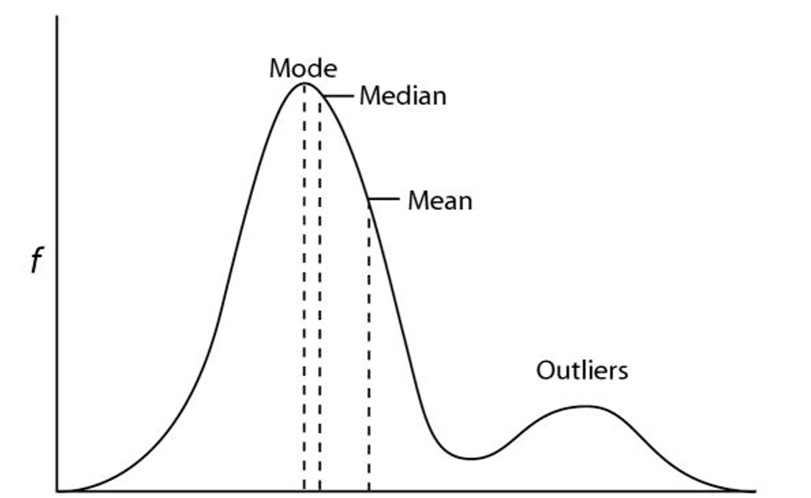
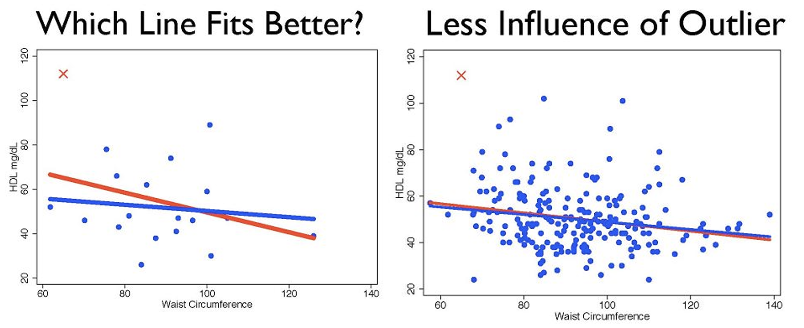

```{r, include = F}
# list of packages for this lecture
library(tidyverse)
```

::: {.content-visible when-format="revealjs"}

------------------------------------------------------------------------

## Lecture 6: Measurement error

------------------------------------------------------------------------
:::

::: {.content-hidden when-format="revealjs"}
```{r, message=FALSE, warning=FALSE}
#| code-fold: true
#| code-summary: "Click to view catchup R code"

# set your working directory with `setwd()`!!

# load packages we need
library(tidyverse)
library(readxl)

# set the theme of all ggplots to `theme_minimal()`
theme_set(theme_minimal())

# read dataset excel file and make sure it's a tibble
ehs655 <- read_xlsx("Dataset V1.xlsx") %>% as_tibble()

# clean job title variable to remove misspellings
ehs655 <- ehs655 %>%
  mutate(
    `Job-title` = 
      case_when(
        `Job-title` == "Lborer" ~ "Laborer",
        `Job-title` == "Laboerr" ~ "Laborer",
        `Job-title` == "Electrican" ~ "Electrician",
        `Job-title` == "Carpentr" ~ "Carpenter",
        `Job-title` == "Operaing engineer" ~ "Operating engineer",
        `Job-title` == "Ironworkr" ~ "Ironworker",
        `Job-title` == "" ~ NA,
        .default = `Job-title`))

# convert LEQ values <LOD to LOD/sqrt(2)
ehs655 <- ehs655 %>%
  mutate(`Work-LEQ-dBA` = ifelse(`Work-LEQ-dBA` < 70, 70/sqrt(2), `Work-LEQ-dBA`))
```
:::

### What we'll cover today

- Data cleaning/outliers

- R

- Assignment 1

------------------------------------------------------------------------

### Data cleaning

- Process of identifying/correcting corrupt or untenable information to ensure data integrity

  - May mean alteration or removal of data

- Critical element of exposure analysis

  - Insuring completeness of data

  - Placing constraints/range limits on values

  - Comparing values with well-understood relationships for validity

------------------------------------------------------------------------

### Quality control for exposure data

- Standard operating procedures

  - In place? Followed?

- Exposure measurement equipment

  - Known and consistent? Values outside of measurement range?

- Equipment calibration

  - Equipment calibrated regularly? Did all measurements meet calibration specs?

- Data entry

  - Any untenable data? Programming mistakes?

------------------------------------------------------------------------

### Outliers

{width="90%"}

------------------------------------------------------------------------

### Outliers

- Observation that deviates markedly from other observations

- Outlying point may indicate bad data

  - May have been measured or coded incorrectly

  - If erroneous, delete from analysis (or correct)

- May be due to random variation or may indicate something scientifically interesting

  - Typically do not want to simply delete

  - May need to use robust statistical techniques

------------------------------------------------------------------------

### Identifying outliers

::::: columns-only-on-slides
::: slide-column
- No rigid definition

  - Boxplots, normal probability plots

- **IQR approach:** (IQR\*1.5) + Q3 [OR]{.underline} Q1 - (IQR\*1.5)

  - Values beyond these limits may be considered outliers

- Robust statistics are capable of coping with outliers

  - Median is robust, mean is not
:::

::: slide-column
```{r}
plot1 <- ehs655 %>%
  ggplot(aes(sample = `Work-LEQ-dBA`)) +
  stat_qq() +
  stat_qq_line(color = "red") +
  labs(x = "Noise residuals", y = "Noise levels (dBA)")

plot2 <- ehs655 %>%
  ggplot(aes(x = `Work-LEQ-dBA`)) +
  geom_boxplot() +
  coord_flip()

### a new package to combine two plots side-by-side
# install.package("ggpubr")
library(ggpubr)

ggarrange(plot1, plot2, nrow = 1) # nrow = 1 ensures they end up side-by-side
```
:::
:::::

------------------------------------------------------------------------

### Treatment of outliers

- Outlier labeling

  - Flag potential outliers for further investigation

- Outlier treatment

  - Formally test whether points are outliers/plausible (e.g., Cook’s distance in linear regression)

  - Delete/correct as appropriate (note – deletion generally frowned on, particularly in smaller datasets)

- Outlier accommodation

  - Use robust statistical techniques (median not mean)

  - Consider whether data need to be transformed (e.g., perhaps distribution is lognormal, not normal?)

------------------------------------------------------------------------

### Treatment of outliers

- Evaluate reasonableness

  - Classify as plausible, highly implausible, impossible

  - Consider body temperature

  - 38 degrees C reasonable; 38 degree F not

- Evaluate importance

  - Leverage (value of x is far from mean of x)

  - Influence (relationship between x and y different than other x and y points)

------------------------------------------------------------------------

### Outliers: (data) size does matter

{width="95%"}

------------------------------------------------------------------------

### On to R

Data cleaning! Check to see if we have any missing noise samples with `is.na()`

```{r}
ehs655 %>%
  filter(is.na(`Work-LEQ-dBA`))
```

------------------------------------------------------------------------

### More R

Example of creating new columns (`mutate()`)

```{r}
ehs655 %>%
  mutate(average_noise = mean(`Work-LEQ-dBA`)) %>%
  mutate(noise_rank = min_rank(`Work-LEQ-dBA`)) %>%
  mutate(average_noise_diff = `Work-LEQ-dBA`- average_noise) %>%
  select(`Work-LEQ-dBA`, average_noise, noise_rank, average_noise_diff) %>%
  arrange(noise_rank)
```

------------------------------------------------------------------------

### Even more R

Bivariate analysis examples. We can use the `janitor` package to get `tidyverse` friendly tables

::::: columns-only-on-slides
::: slide-column
```{r, message=FALSE, warning=FALSE}
#install.packages("janitor")
library(janitor)

# two-variable count
ehs655 %>% tabyl(`Job-title`, `Gender`)
```

```{r}
# three-variable count
ehs655 %>% tabyl(`Job-title`, `Gender`, `Site-type`)
```
:::

::: slide-column
```{r}
# summary statistics by group
ehs655 %>% 
  group_by(`Job-title`) %>% 
  summarise(mean = mean(`Work-LEQ-dBA`))
```

```{r}
# summary statistics by group
ehs655 %>% 
  ggplot(aes(x = `Work-LEQ-dBA`, y = `Measured-shift-length-mins`)) +
  geom_point()
```
:::
:::::

------------------------------------------------------------------------

### Last little bit of R

R allows `_` or `.` in column names, but not other characters that can be an operator (e.g., `-`)

I'm sick of using the back ticks (\`) to call our column names

I could use `rename()` and manually change all of the column names one by one (too cumbersome)

Instead, we can clean column names with the `janitor` package and `clean_names()` function

```{r}
ehs655 <- ehs655 %>% clean_names()
ehs655
```

This forces all column names to be lowercase and "snake_case"
