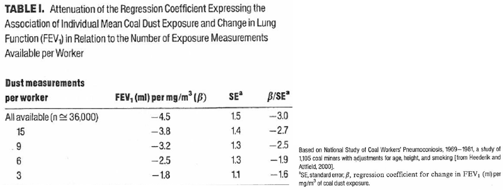
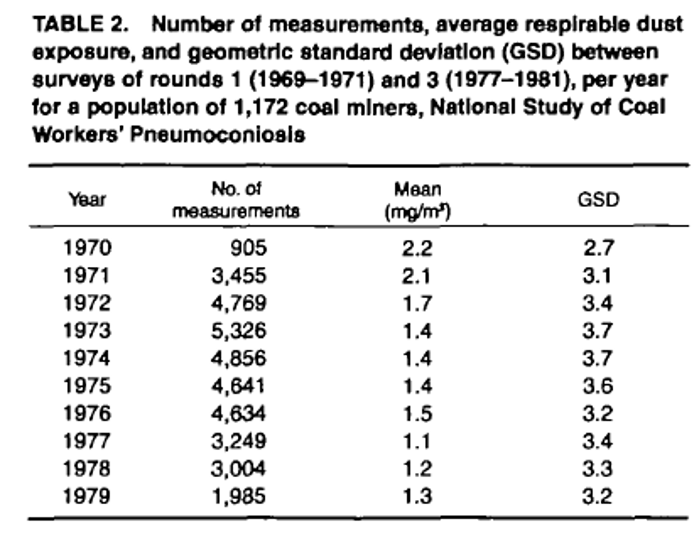
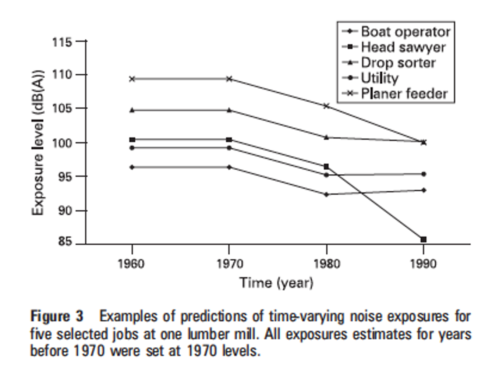
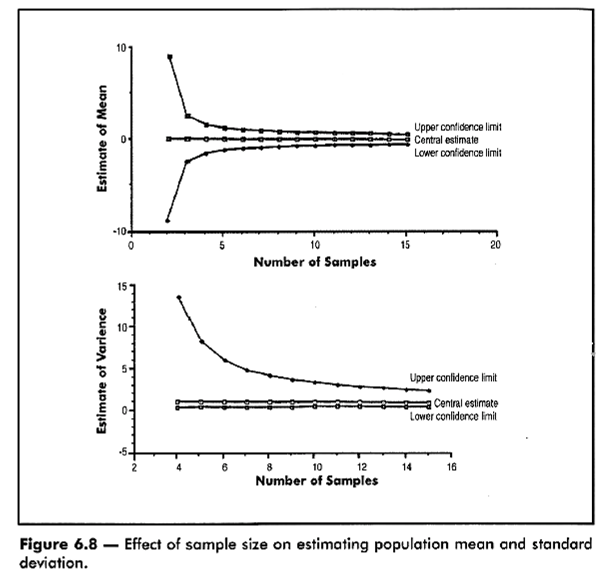
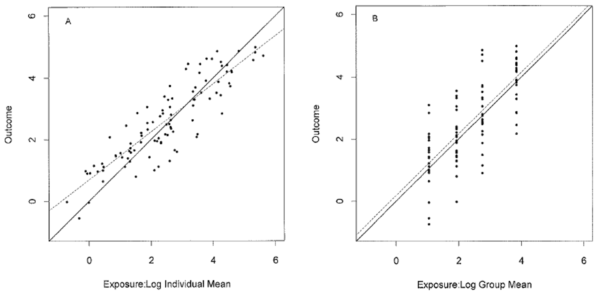
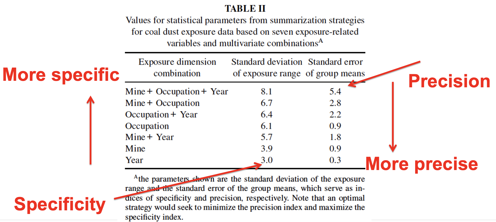
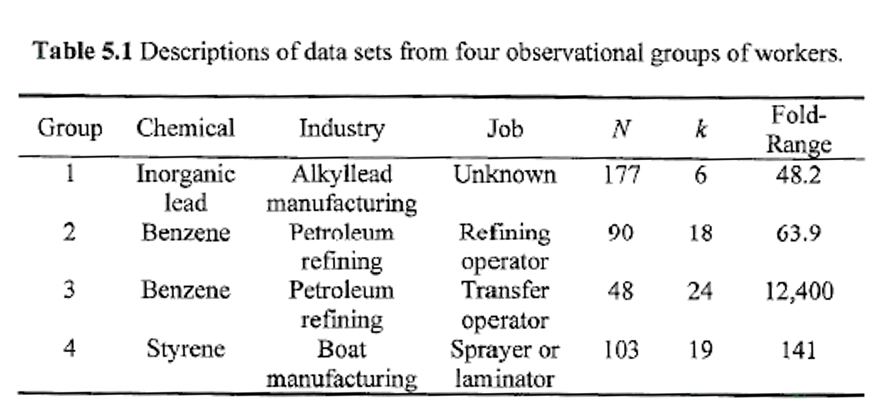
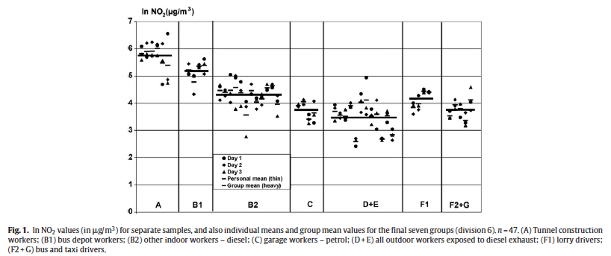
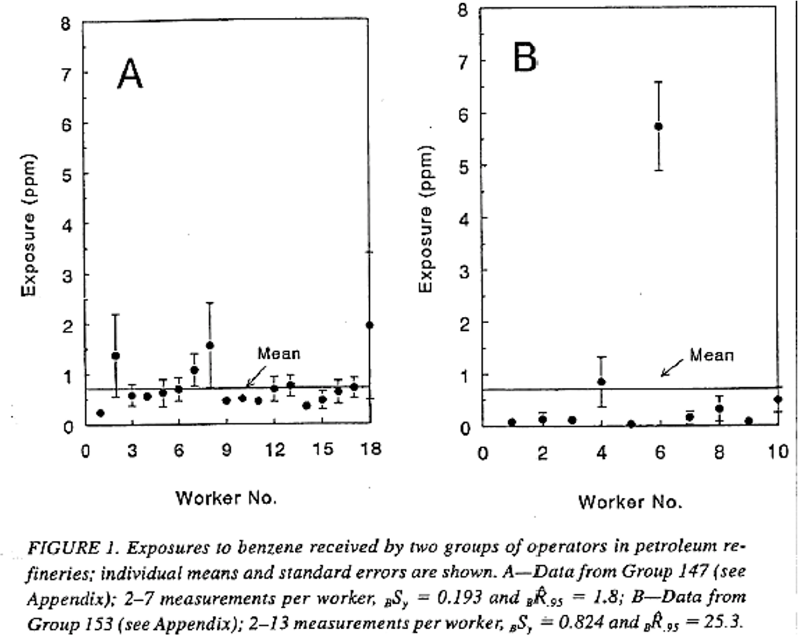
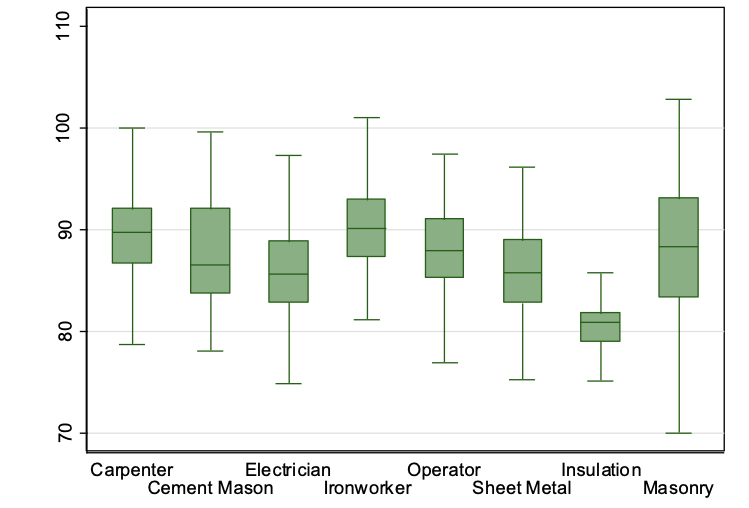

::: {.content-visible when-format="revealjs"}

------------------------------------------------------------------------

## Lecture 7: Measurement error and exposure grouping strategies

------------------------------------------------------------------------
:::

### What we'll cover today

- Sampling issues

- Temporal trends

- Exposure groups

------------------------------------------------------------------------

### Repeated measurements

{width="90%"}

::: custom-footer
Loomis, Kromhout, 2004
:::

------------------------------------------------------------------------

### Sampling issues

- Several different sampling strategies

  - Haphazard/convenience

  - Worst case

  - Representative

  - Random

- How exposures were collected may determine what we can infer from them

- Also need to consider temporal trends

- [**Question:** what are the strengths and weaknesses of each of these approaches?]{style="color: blue;"}

------------------------------------------------------------------------

### Sampling issues - temporal trends

{width="70%"}

::: custom-footer
Heederik, Attfield, 2000
:::

------------------------------------------------------------------------

### Sampling issues - temporal trends

{width="80%"}

::: custom-footer
Davies, Teschke, Kennedy, Hodgson, Demers, 2008
:::

------------------------------------------------------------------------

### Individual-level assessment

- Exposure varies greatly over time and space

- Measure individuals’ exposures

  - Use repeated measurements on individual to calculate individual average (only their data)

  - Often considered gold standard approach

{width="50%"}

::: custom-footer
Ignacio and Bullock, AIHA, 2006
:::

------------------------------------------------------------------------

### Question

If individual-level approach is gold standard, come up with **at least two reasons** we might want to create exposure groups?

------------------------------------------------------------------------

### Reasons we might not want individual-level assessments

- Even with repeated measurements, measured average level is at best approximation of true exposure

  - N of repeated measurements per individual usually small (scarcity of data)

- Higher within-person variability and/or smaller inter-person variability = more attenuation of exposure-response relationship

- Logistical/financial challenges

- Lack of direct access to individuals

------------------------------------------------------------------------

### Exposure groups

- To address scarce individual data, we commonly pool data across individuals

  - Create group estimates

- Increased amount of data in groups reduces random variability associated with estimate

- Apply group estimates to individuals who likely have similar exposures

  - May not be truly applicable to all individuals in group

------------------------------------------------------------------------

### Group level assessment

- Create subgroups based on common features of exposure

  - Ideally, all workers within each group measured

  - Must consider between-group, within-group, within-individual variability

::: custom-footer
Tielemans, Kupper, Kromhout, Heederik, Houba, 1998
:::

------------------------------------------------------------------------

### Advantages of grouping

- Often more effective than individual-level assessment

  - Especially when temporal variability large

- Logistically less demanding than individual approach

- Should result in almost unbiased estimated coefficients of exposure-response relationship

  - Attenuation very small with grouped exposure data

------------------------------------------------------------------------

### Grouping and attenuation

{width="95%"}

::: custom-footer
Seixas and Sheppard, 1996
:::

------------------------------------------------------------------------

### Exposure groups

- Originally “Homogeneous exposure groups” (HEGs)

- Changed to “Similar exposure groups” (SEGs)

- Groups frequently defined by common structures

  - E.g., job title, work area, activity, behavior, agent, street, etc Individuals in different groups assumed to have different exposures

- Individuals within groups also have different exposures

  - Differences in activities, behaviors, protective equipment

------------------------------------------------------------------------

### Exposure groups

- Statistical measures of central tendency often applied to groups

  - Mean, median, mode

  - We treat every individual in the group as though they are exposed at the this measure of central tendency

- For categorical exposures, we assume groups are exposed (1) or unexposed (0)

  - Assumes zero variability in groups

------------------------------------------------------------------------

### What do we need to think about when grouping people?

- Specificity

  - Summarizes variance within group

  - Small variance = highly specific

- Precision

  - Summarizes variance between groups

  - Large variance = highly precise

------------------------------------------------------------------------

### Exposure grouping goals

::::: columns-only-on-slides
::: slide-column
Goal 1: create groups with retain true individual differences (specificity)

- i.e., within-group variability small compared to between-group variability

{width="90%"}
:::

::: slide-column
Goal 2: create groups that are as large as possible (precision)

- Leads to exposure estimates that are more precise than individual worker means

{width="90%"}
:::
:::::

------------------------------------------------------------------------

### Specificity vs precision (from the reading)

{width="80%"}

::: custom-footer
Werner, Attfield, 2000
:::

------------------------------------------------------------------------

### Grouping strategies

- ***A priori***

  - Grouping takes place [**before**]{.underline} measurement is made

- ***A posteriori***

  - Grouping takes place [**after**]{.underline} measurement is made

------------------------------------------------------------------------

### Ways to create exposure groups

**Group by**

- Activity type

- Process

- Agent

- Exposure pathway

- Location

- Time

- Etc.

{width="50%"}

------------------------------------------------------------------------

### Example: grouping by agent

**Note variation in group size, exposure range, repeated measures**

{width="80%"}

------------------------------------------------------------------------

### Example: grouping by job title

{width="95%"}

::: custom-footer
Lewne, Plato, Bellander, Alderling, Gustavsson, 2010
:::

------------------------------------------------------------------------

### Example - grouping outcomes

::::: columns-only-on-slides
::: slide-column
**Possibilities**

- Within group variability \> between group variability

- Between group variability \> within group variability

[Question: which of these grouping approaches is preferred?]{style="color: blue;"}
:::

::: slide-column
{width="90%"}
:::
:::::

::: custom-footer
Rappaport, Kromhout, Symanski, 1993
:::

------------------------------------------------------------------------

### Group size and attenuation bias

**Reducing attenuation bias**

- Increasing number of subjects per group can be as effective as increasing number of measurements per subject

------------------------------------------------------------------------

### Question

What do you think of this as a grouping strategy, and why?

{width="60%"}
