::: {.content-visible when-format="revealjs"}

------------------------------------------------------------------------

## Lecture 8: Exposure grouping and metrics

------------------------------------------------------------------------
:::

::: {.content-hidden when-format="revealjs"}
```{r, message=FALSE, warning=FALSE}
#| code-fold: true
#| code-summary: "Click to view catchup R code"

# set your working directory with `setwd()`!!

# load packages we need
library(tidyverse) # data manipulation and plotting
library(readxl) # reading in our excel dataset
library(janitor) # cleaning columns names and more

# set the theme of all ggplots to `theme_minimal()`
theme_set(theme_minimal())

# read dataset excel file and make sure it's a tibble
ehs655 <- read_xlsx("Dataset V1.xlsx") %>% as_tibble()

# make all column names lowercase and snake_case
ehs655 <- ehs655 %>% clean_names()

# clean job title variable to remove misspellings
ehs655 <- ehs655 %>%
  mutate(
    job_title = 
      case_when(
        job_title == "Lborer" ~ "Laborer",
        job_title == "Laboerr" ~ "Laborer",
        job_title == "Electrican" ~ "Electrician",
        job_title == "Carpentr" ~ "Carpenter",
        job_title == "Operaing engineer" ~ "Operating engineer",
        job_title == "Ironworkr" ~ "Ironworker",
        job_title == "" ~ NA,
        .default = job_title))

# clean gender variable to fix multiple classification schemes
ehs655 <- ehs655 %>%
  mutate(
    gender = 
      case_when(
        gender == "M" ~ "Male",
        gender == "F" ~ "Female",
        .default = gender))

# convert LEQ values <LOD to LOD/sqrt(2)
ehs655 <- ehs655 %>%
  mutate(work_leq_d_ba = ifelse(work_leq_d_ba < 70, 70/sqrt(2), work_leq_d_ba))
```
:::

### What we'll cover today

- A bit more on grouping exposures

- Exposure metrics

------------------------------------------------------------------------

### How can we quantify grouping effectiveness?

- Look at variance within and between groups

- One summary measure is referred to as contrast (ability to create groups with different exposures)

- Contrast

$$
\epsilon = \frac{_{BG}S^{2}_{y}}{(_{BG}S^{2}_{y}+_{WG}S^{2}_{y})}
$$

------------------------------------------------------------------------

### Contrast

- Grouping affects standard error of exposure-response slope very adversely if low contrast between groups

  - Ratio of within-group to between-group variance \>1 leads to low contrast

- So, grouping schemes must be optimized

  - A priori grouping by job may not address factors that actually affect exposure

------------------------------------------------------------------------

### Grouping - contrast

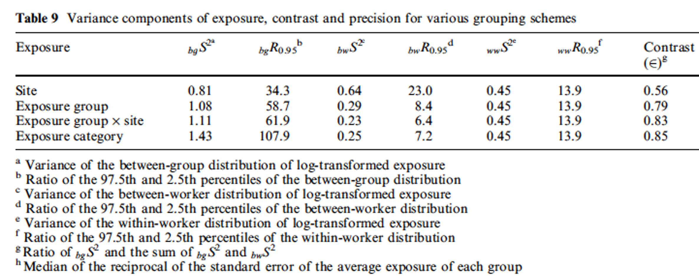{width="95%"}

::: custom-footer
Niewenheijsen, 1997
:::

------------------------------------------------------------------------

### Job exposure matrix

- Large-scale grouping strategy

- Essentially a giant table with 3 axes

  - Agent

  - Exposure

  - Time

- Often used in large population-based studies

  - Few or no measurements on study subjects

------------------------------------------------------------------------

### Simple job exposure matrix example

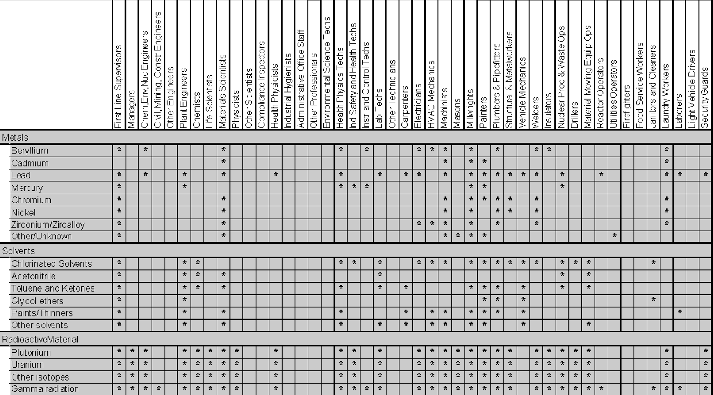{width="80%"}

------------------------------------------------------------------------

### More complex job exposure matrix example

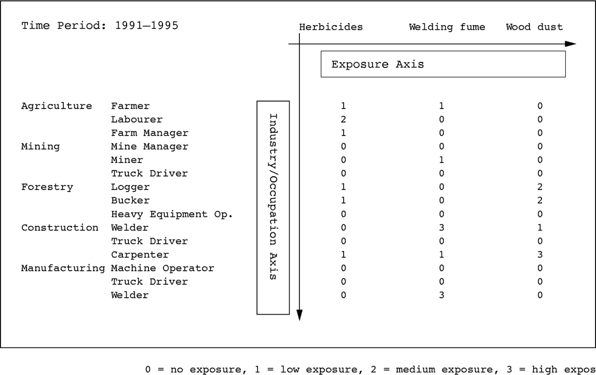{width="80%"}

::: custom-footer
<https://oem.bmj.com/content/oemed/62/4/272/F3.large.jpg>
:::

------------------------------------------------------------------------

### Grouping by exposure

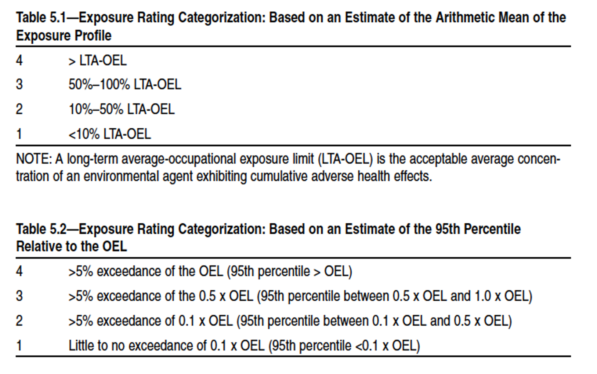{width="85%"}

::: custom-footer
AIHA, *Strategy for Assessing and Managing Occupational Exposures*, 3rd ed, 2006
:::

------------------------------------------------------------------------

### What about complicated variables?

- How many categories are there in `PrimaryTaskShift` variable?

  - (SPOILER ALERT: a lot!)

- Is this manageable? If not, consider collapsing into fewer categories, [*as long as you have good rationale*]{.underline}

  - Combine tasks with similar central tendency and distributions

    - If all equipment used by operating engineers has similar levels, make one "operating heavy equipment" variable?

  - Combine tasks that seem similar

    - Could panel wiring and pulling wire be combined as "wiring”? Could chipping concrete and grinding concrete be "concrete work"? Could building and stripping forms be "formwork"?

------------------------------------------------------------------------

### Exposure metrics

How we quantify/define exposure

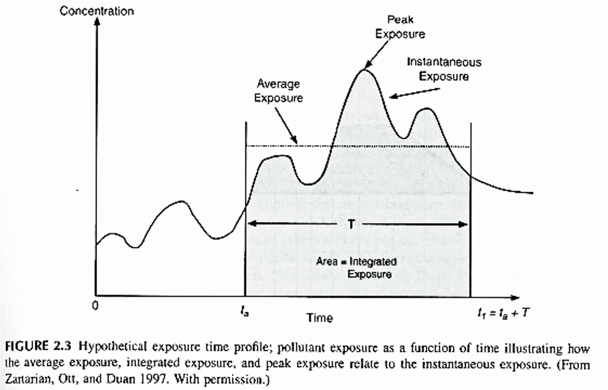{width="75%"}

::: custom-footer
WR Ott, AC Steinemann, LA Wallace, 2007
:::

------------------------------------------------------------------------

### Examples of exposure metrics

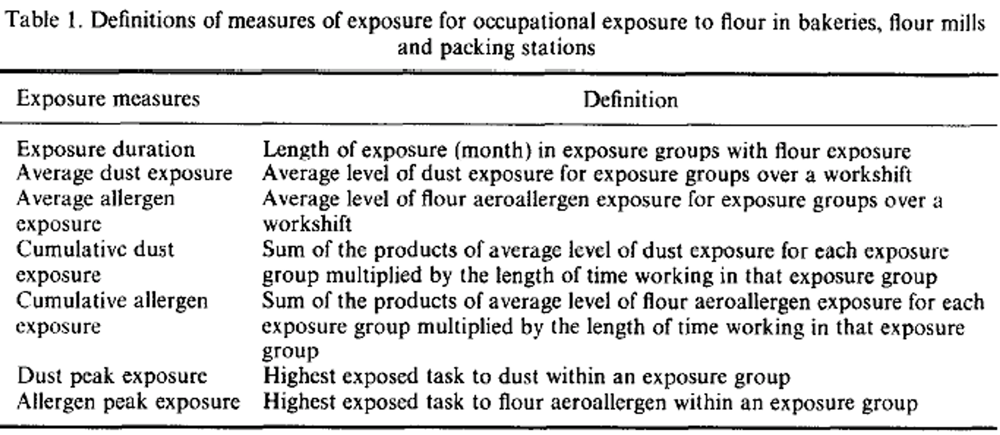{width="95%"}

::: custom-footer
Nieuwenhuijsen, Lowson, Venables, Newman Taylor, 1995
:::

------------------------------------------------------------------------

### Examples of exposure metrics (applied to noise)

Average exposure

$L_{Aeq,T} = 10\cdot\text{log}[\frac{1}{T}\sum\limits_{i=1}^{N}t_i\cdot10^{L_{Ai}/10}]$

Where

- $T$ is total duration

- $t_i$ is an interval within duration

- $N$ is total number of intervals

- $L_A$ is A-weighted noise level

Note: this is the level in the `WorkLEQdBA` variable

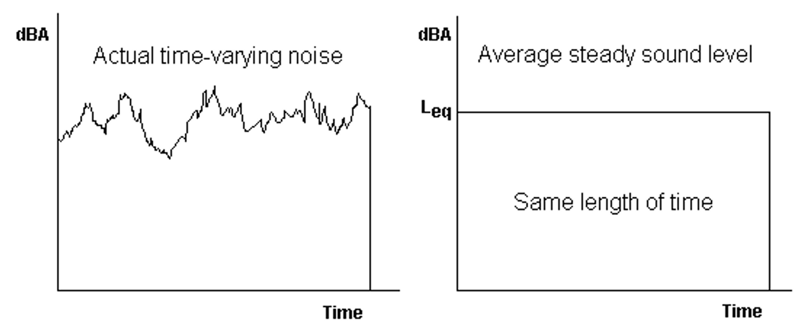{width="50%"}

::: custom-footer
Chapter 3, AIHA Noise Manual, 2022
:::

------------------------------------------------------------------------

### Average vs Time-Weighted Average (TWA)

TWA normalizes measurements to a standard exposure (typically 8 hours)

$$
L_{A8hn} = 10 \cdot \text{log}[\frac{1}{8}\int_0^T 10^{L_A(t)/10}dt] = L_{Aeq,T} + 10 \cdot \text{log}(\frac{T}{8})
$$

Where

- $L_{A8hn}$ = 8-hour equivalent exposure

- $T$ is duration of exposure (in hours)

Note: you have duration of exposure in minutes

::: custom-footer
Chapter 3, AIHA Noise Manual, 2022
:::

------------------------------------------------------------------------

### Why convert average to TWA?

Allows for direct comparison of exposures measured over different periods

For example:

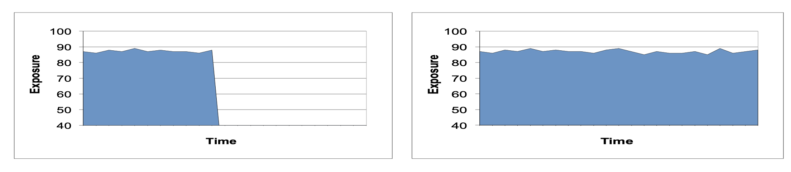{width="90%"}

Both of these exposures have the same LEQ average

However, TWA for right-hand exposure would be 2X as high, since monitoring duration is 2X as long

------------------------------------------------------------------------

### Peakiness metrics

Ratio of peak or maximum to average?

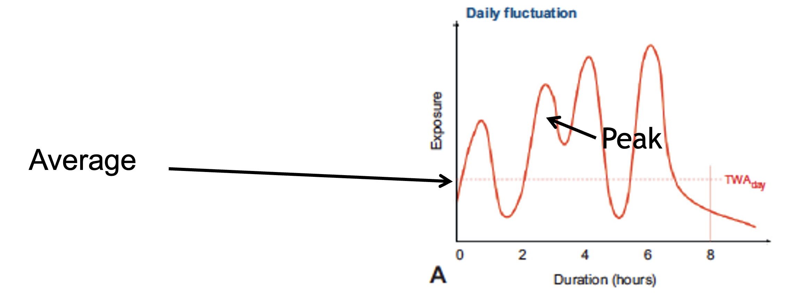{width="90%"}

::: custom-footer
Moretto A, *Handbook Clin Neurol*, 2015
:::

------------------------------------------------------------------------

### Example of exposure metrics (applied to noise)

Ratio exposure (peakiness)

$$
\text{Ratio of }L_{MAX}/L_{EQ} = \frac{L_{MAX(\text{in dBA})}}{L_{EQ(\text{in dBA})}}
$$

Provides summary of highest exposure during measurement to average exposure during measurement

------------------------------------------------------------------------

### Example relationships between exposure metrics

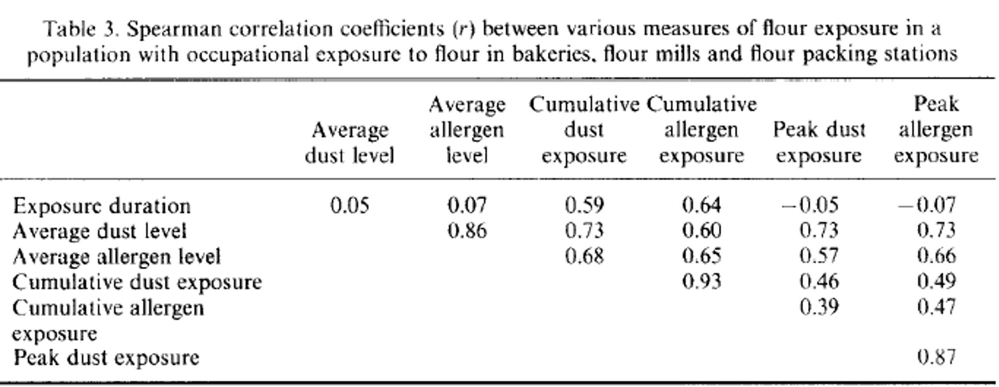{width="90%"}

::: custom-footer
Nieuwenhuijsen, Lowson, Venables, Newman Taylor, 1995
:::

------------------------------------------------------------------------

### Example relationships between exposure metrics

- Created composite index of exposure

  - At area level, not personal

- Also allows for assessment of correlations between combinations of exposures

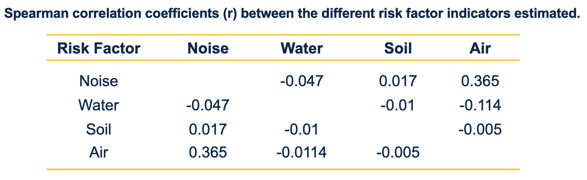{width="50%"}

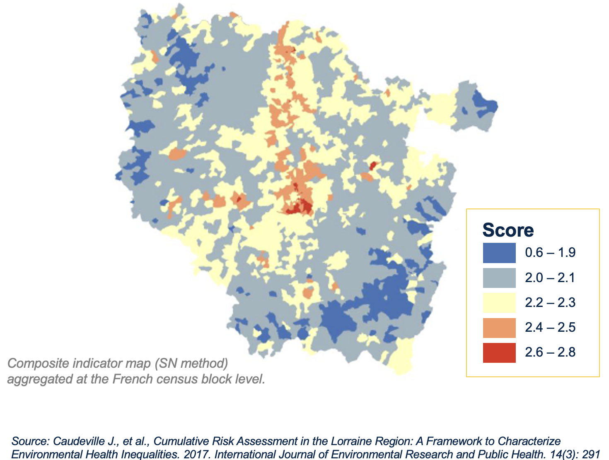{width="60%"}

------------------------------------------------------------------------

### Relationship of annual exposure metrics by person

**Question: do we want these to be highly or poorly correlated?**

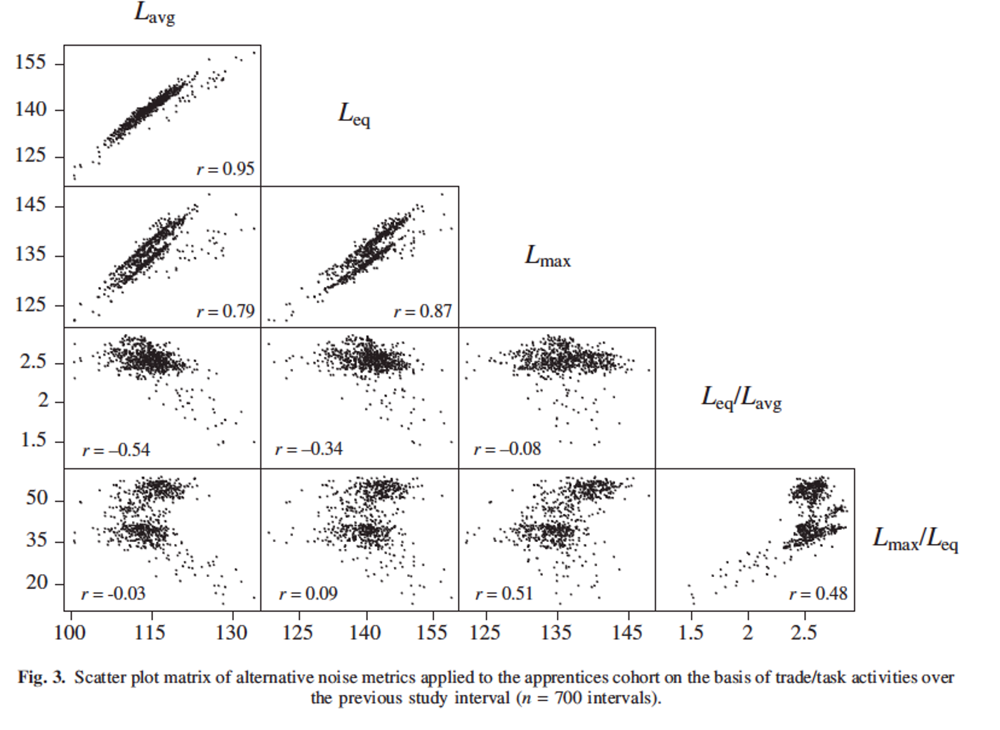{width="80%"}

::: custom-footer
Seixas, Neitzel, Sheppard, Goldman, 2004
:::

------------------------------------------------------------------------

### Metrics - agent of interest

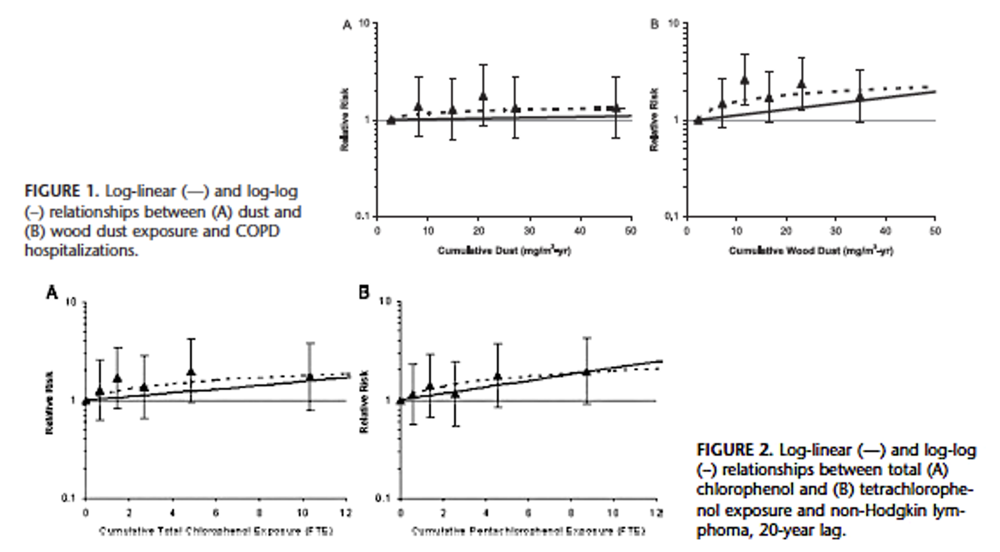{width="90%"}

::: custom-footer
Friesen et al, 2007
:::

------------------------------------------------------------------------

### Metrics - average and variability

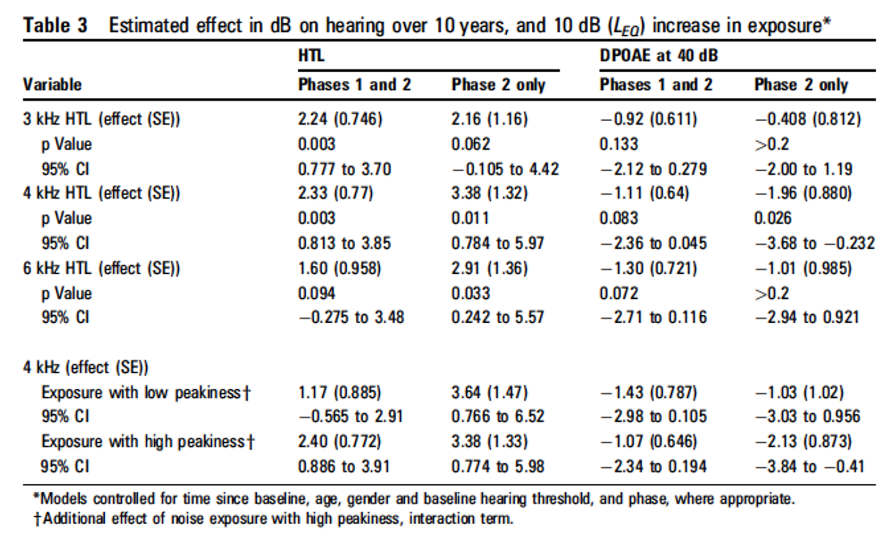{width="85%"}

::: custom-footer
Seixas, Neitzel, Stover, Sheppard, Feeney, Mills, Kujawa, 2012
:::

------------------------------------------------------------------------

### Combination of exposure groups and exposure metrics

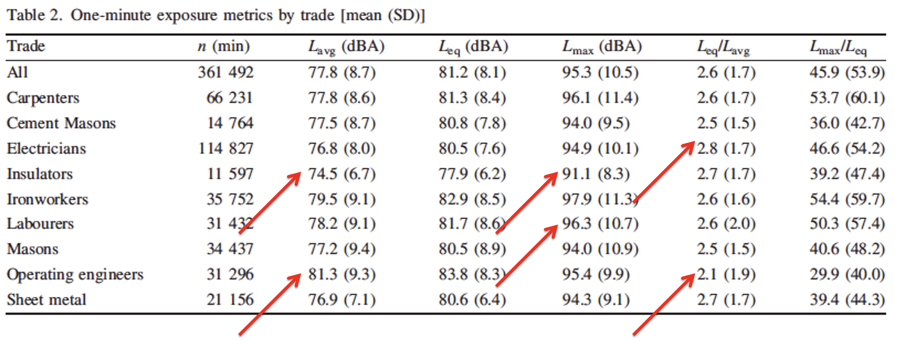{width="95%"}

::: custom-footer
Seixas, Neitzel, Sheppard, Goldman, 2004
:::

------------------------------------------------------------------------

### Metrics and exposure limits

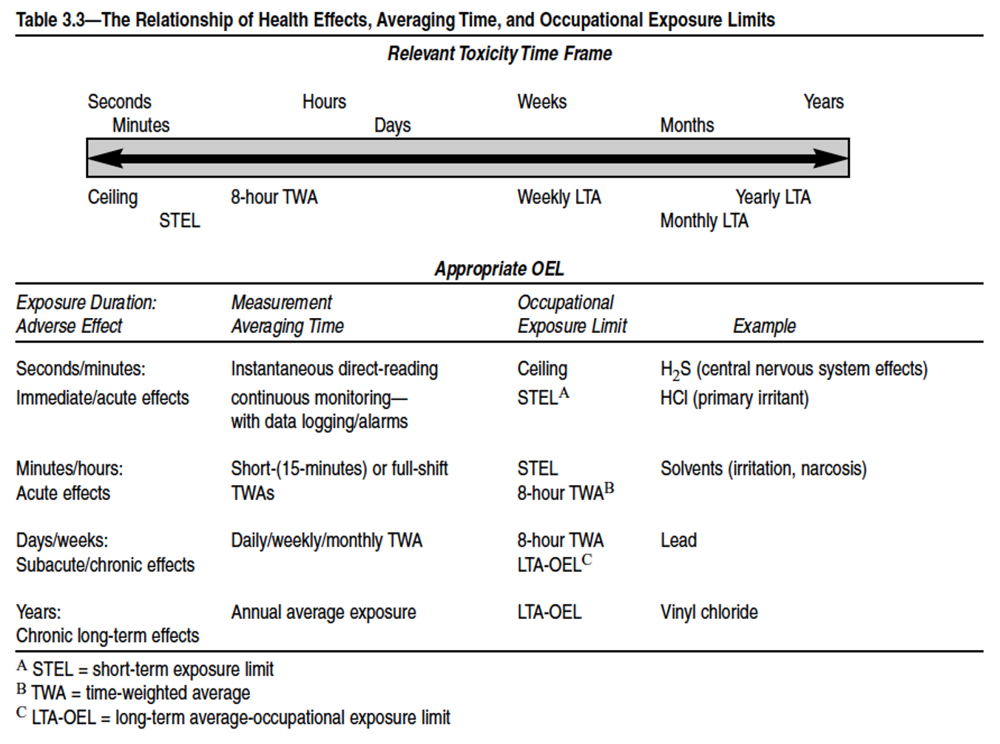{width="75%"}

::: custom-footer
AIHA, *Strategy for Assessing and Managing Occupational Exposures*, 3rd ed, 2006
:::

------------------------------------------------------------------------

### A bit more on data cleaning

Example of how to treat missing data

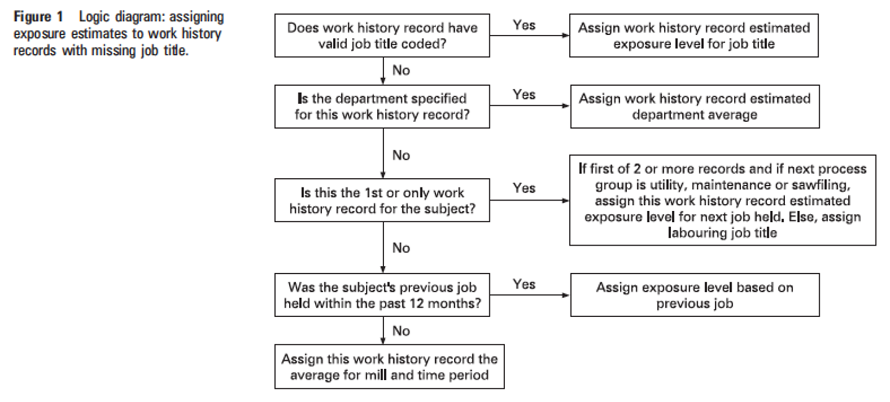{width="80%"}

::: custom-footer
Davies, Teschke, Kennedy, Hodgson, Demers, 2008
:::

------------------------------------------------------------------------

### Example: data cleaning

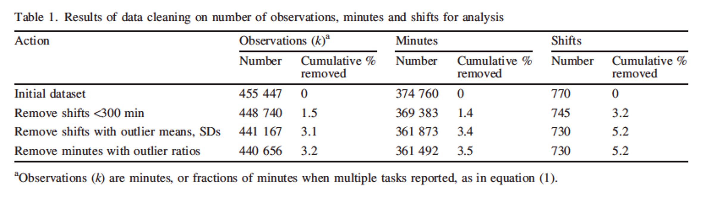

::: custom-footer
Seias, Neitzel, Sheppard, Goldman, 2004
:::

------------------------------------------------------------------------

### Back to R

- What exposure metrics can we look at in our data?

- Average and TWA

  - How to compute TWA?

  - By individual? By group?

- Maximum

  - By individual? By group?

- Peakiness metric?

  - How to compute peakiness?

  - Maximum / average?

------------------------------------------------------------------------

### R

::::: columns-only-on-slides
::: slide-column
$\text{TWA}=L_{EQ}+\text{log10(Runtime/480)}$

```{r}
ehs655 <- ehs655 %>%
  mutate(
    TWA = 
      work_leq_d_ba + 10*log10(measured_shift_length_mins/480)
    )
```

$\text{Peakiness}=L_{MAX}/L_{EQ}$

```{r}
ehs655 <- ehs655 %>%
  mutate(
    peakiness = 
      lmax_d_ba_shift/work_leq_d_ba
  )
```
:::

::: slide-column
```{r}
ehs655 %>%
  select(work_leq_d_ba, measured_shift_length_mins, TWA, peakiness)
```
:::
:::::
